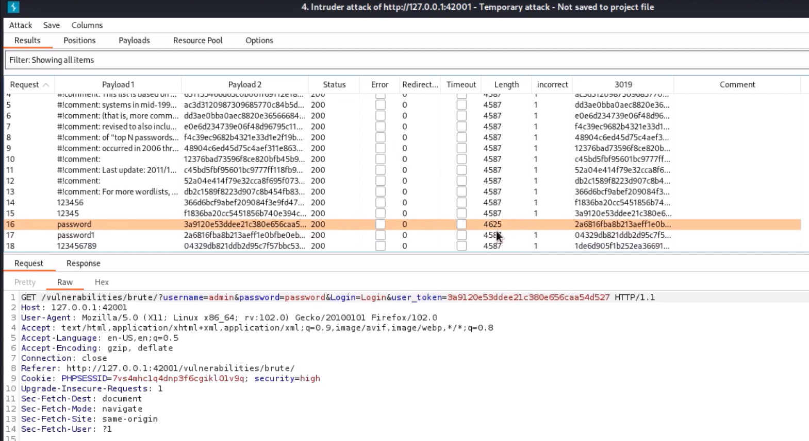

import DvwaLab from '@site/src/components/DvwaLab';

# Brute Force — High

Bij het **High** niveau wordt het menens. De ontwikkelaar heeft een techniek toegevoegd die "Anti-CSRF Tokens" heet.

## 1. Predict (Voorspel)

Bekijk de broncode van het inlogscript op High niveau (klik in het lab op 'Bekijk broncode'). Je ziet daar een extra controle staan:

```php
if( $_SESSION[ 'user_token' ] !== $_REQUEST[ 'user_token' ] ) {
    // Foutmelding: CSRF token mismatch
}
```

**Vraag:** Waarom werkt ons Hydra-commando van het *Low* of *Medium* niveau hier absoluut niet meer, zelfs niet als we de security op `high` zetten?

<details>
<summary>Antwoord</summary>

Bij Low en Medium konden we simpelweg duizenden verzoeken sturen met alleen een gebruikersnaam en wachtwoord. Bij High genereert de server voor **elk** inlogformulier een uniek, geheim 'token' (een lange code). De server accepteert een inlogpoging *alleen* als je dat exacte token meestuurt. 
Omdat het token bij elke poging verandert, kan Hydra niet simpelweg één commando herhalen; hij zou bij elk wachtwoord eerst de pagina moeten laden, het nieuwe token moeten 'lezen' en dat dan meesturen. Dat kan de standaard Hydra niet zomaar.
</details>

## 2. Run & Investigate

1. Start het lab op **High** niveau.
2. Probeer je Hydra-commando van het Medium level nogmaals uit (vergeet niet `security=high` aan te passen).

Wat zie je in de output van Hydra? Waarschijnlijk zie je dat Hydra denkt dat **elk** wachtwoord fout is, of (gevaarlijker) dat hij denkt dat ze allemaal goed zijn. In ieder geval vind je het juiste wachtwoord niet.

## 3. Modify & Make (Aanpassen & Maken)

Om dit te hacken heb je een tool nodig die "slim" genoeg is om tokens uit de HTML te vissen. Een professionele tool hiervoor is **Burp Suite**. 

In de professionele wereld zou je Burp Suite 'Intruder' gebruiken. Deze tool kan voor elke regel in je wachtwoordlijst eerst de pagina opvragen, het token zoeken, en dat vervolgens in de aanval plakken.



**Opdracht:**
Omdat we in deze cursus Burp Suite proberen te vermijden ten gunste van browser-tools, is de uitdaging hier vooral **begrijpen** waarom het token de aanval stopt. 

Kijk in de browser-inspector (F12) bij het tabblad **Network**. 
1. Vul een fout wachtwoord in en klik op Login.
2. Zoek het verzoek op in de lijst en kijk bij de **Payload** of **Query String Parameters**.
3. Zie je daar de `user_token` staan? 
4. Ververs de pagina en doe het nog een keer. Is het token veranderd?

<details>
<summary>Antwoord</summary>
Ja, het token verandert elke keer dat de pagina wordt geladen. Dit maakt automatische "domme" aanvallen onmogelijk.
</details>

## 4. ✓ Wat moest je zien?

:::tip Controle
- Je begrijpt dat een `user_token` bedoeld is om te voorkomen dat tools zoals Hydra simpelweg duizenden keren hetzelfde formulier kunnen posten.
- Je hebt gezien in de Network-tab dat het token inderdaad bij elk verzoek wordt meegestuurd en dat het steeds anders is.
:::

## 5. Er gaat iets mis...

Je probeert het token handmatig te kopiëren en in je Hydra-commando te plakken: `...&user_token=abc123...`. 
Waarom werkt dit nog steeds niet voor de rest van de lijst?

Omdat zodra Hydra de éérste poging doet met dat token, de server dat token "verbruikt". Voor de tweede poging is een nieuw token nodig. Handmatig kopiëren is dus zinloos voor een lijst van 10.000 wachtwoorden!

## Wat heb je geleerd?

- **Anti-CSRF Tokens** zijn een krachtig middel tegen brute-force aanvallen.
- Ze dwingen een aanvaller om veel complexere (en tragere) tools te gebruiken.
- Beveiliging is vaak een kat-en-muisspel: hoe beter de verdediging, hoe geavanceerder de tools van de hacker moeten zijn.
