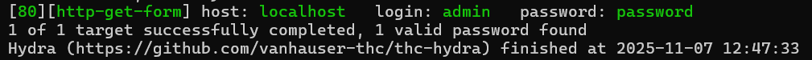

import DvwaLab from '@site/src/components/DvwaLab';

# Brute Force — Low

Welkom bij Brute Force. We leren hoe automatische tools razendsnel wachtwoorden kunnen raden wanneer een inlogformulier geen bescherming heeft.

## 1. Predict (Voorspel)

Wanneer je inlogt op de DVWA Brute Force pagina, stuurt het formulier jouw gegevens via een **GET**-request. De URL ziet er na het klikken op Login zo uit:

```
http://localhost/DVWA/vulnerabilities/brute/?username=admin&password=test&Login=Login
```

**Vraag:** Waarom is het gebruik van een GET-request voor een inlogformulier een probleem, en hoe maakt dit brute-force aanvallen makkelijker?

<details>

<summary>Antwoord</summary>

Bij een GET-request staan de gebruikersnaam en het wachtwoord letterlijk in de URL. Iedereen die meekijkt (browsergeschiedenis, serverlogboeken, netwerksniffer) kan ze direct lezen.

Bovendien maakt de URL-structuur het triviaal om een programma te schrijven dat duizenden wachtwoorden per seconde probeert door de URL steeds opnieuw op te vragen met een andere `password=`-waarde. Een tool als **Hydra** doet precies dit.

</details>

## 2. Run (Uitvoeren)

Start het lab en bekijk het inlogformulier.

<DvwaLab module="brute_force" level="low" />

Probeer in te loggen met de gebruikersnaam `admin` en een willekeurig wachtwoord (bijv. `test`). Observeer de URL in de adresbalk na het klikken op Login.

## 3. Investigate (Onderzoeken)

Druk op **F12** en ga naar het tabblad **Application** → **Cookies** → `http://localhost`. Zoek de cookie met de naam `PHPSESSID`.

Kijk ook via **F12** → **Elements** naar de `name`-attributen van de invoervelden voor gebruikersnaam en wachtwoord.

**Vraag:** Welke drie gegevens heeft een automatisch tool minimaal nodig om het inlogformulier te kunnen aanvallen: (1) de sessie-identificatie, (2) de veldnamen, en (3) een manier om te weten of een wachtwoord goed of fout is?

<details>

<summary>Antwoord</summary>

1. **PHPSESSID** — De tool moet zich voordoen als jouw ingelogde browsersessie, anders weigert DVWA het verzoek.
2. **Veldnamen** — De `name`-attributen in de HTML zijn `username` en `password`. Zonder deze weet de tool niet waar hij de waarden moet plaatsen.
3. **Foutmelding** — Na een verkeerd wachtwoord toont de server de tekst `incorrect`. De tool vergelijkt elk antwoord: als `incorrect` aanwezig is, was het wachtwoord fout; als het ontbreekt, is het wachtwoord gevonden.

</details>

## 4. Modify & Make (Aanpassen & Maken)

Nu hebben we alle puzzelstukjes. Installeer Hydra en pak de woordenlijst uit in je Kali-terminal:

```bash
sudo apt install hydra wordlists && sudo gunzip /usr/share/wordlists/rockyou.txt.gz
```

Kopieer het onderstaande commando naar een kladblok en vervang `PHPSESSID` door de waarde die je in stap 3 hebt gevonden:

```bash
hydra -l admin -P /usr/share/wordlists/rockyou.txt -m '/DVWA/vulnerabilities/brute/:username=^USER^&password=^PASS^&Login=Login:H=Cookie:PHPSESSID=PHPSESSID;security=low:F=incorrect' localhost http-get-form
```

Plak het voltooide commando in je Kali-terminal en druk op Enter.

<details>

<summary>Tip</summary>

Controleer dat je `PHPSESSID` correct hebt ingevuld — inclusief de puntkomma en `security=low` erachter. Verander niets anders aan het commando.

</details>

<details>

<summary>Antwoord</summary>

Na enkele seconden verschijnt er groen gekleurde tekst met het gevonden wachtwoord. Het standaard DVWA-admin-wachtwoord is `password`.



</details>

## 5. ✓ Wat moest je zien?

:::tip Controle
- Hydra toont na enige tijd groen gekleurde output met `[80][http-get-form] host: localhost   login: admin   password: password`.
- Er is maar **één** gevonden wachtwoord — niet honderden. Zie je honderden hits? Dan is je `F=incorrect` niet goed gespeld.
- Het wachtwoord klopt: je kunt inloggen op DVWA met `admin` / `password`.

Geen resultaat? Controleer of je PHPSESSID correct is en of DVWA actief is in Kali.
:::

## 6. Er gaat iets mis...

Krijg je een gigantische lijst met honderden "gevonden" wachtwoorden? Dan herkent Hydra de foutmelding niet. Controleer of je het woord `incorrect` (Engelse spelling, kleine letters) exact hebt overgenomen in het `F=`-gedeelte. Als Hydra de foutmelding niet vindt in het antwoord, denkt hij bij *elk* wachtwoord dat het gelukt is.
