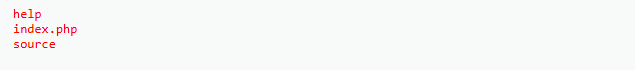

import LinuxTerminal from '@site/src/components/LinuxTerminal';

# Command Injection — High

De ontwikkelaar heeft ons wéér door. Nu worden vrijwel alle injectie-tekens systematisch gefilterd!

## 1. Predict (Voorspel)

De code van de beveiliging ziet er als volgt uit. Bekijk de lijst met verboden tekens aan de linkerkant van de pijltjes:

```php
$substitutions = array(
    '&'  => '',
    ';'  => '',
    '| ' => '',   // ← let op: pipe + spatie, NIET alleen pipe!
    '-'  => '',
    '$'  => '',
    '('  => '',
    ')'  => '',
    '`'  => '',
    '||' => '',
);
$target = str_replace( array_keys( $substitutions ), $substitutions, $target );
```

**Vraag:** Zie je een cruciaal foutje dat de ontwikkelaar hier heeft gemaakt bij het instellen van de filters?

<details>

<summary>Tip</summary>

Kijk heel nauwkeurig naar het filter van de enkele pipe (`|`). Wat staat daar nét achter?

</details>

<details>

<summary>Antwoord</summary>

Er staat `'| ' => ''`. Let op de extra **spatie** na het pipe-teken! Dit betekent dat de webserver specifiek op zoek is naar een pipe-symbool waarna een spatie volgt. Als hij dat tegenkomt, haalt hij het weg.
Maar... wat als we een pipe gebruiken zónder spatie? Dan wordt het niet herkend door dit rammelende filter!

</details>

## 2. Run & Investigate

Probeer de high-filter in de terminal hieronder. Merk op dat `| ` (met spatie) verdwijnt, maar `|` (zonder spatie) er gewoon doorheen glipt. Probeer `ping 127.0.0.1| ls` en `ping 127.0.0.1 | ls` en vergelijk het verschil.

<LinuxTerminal
  title="Command Injection — High (streng gefilterd)"
  filter={(input) => {
    let filtered = input;
    filtered = filtered.replace(/&&/g, '');
    filtered = filtered.replace(/;/g, '');
    filtered = filtered.replace(/\|\| /g, '');
    filtered = filtered.replace(/\| /g, '');
    return filtered;
  }}
/>

## 3. Modify & Make

Bouw je payload in de terminal hierboven. Zodra het werkt, probeer je het op DVWA:

1. Start `DVWA` en ga naar de challenge `Command Injection`. Zorg dat je `DVWA Security` op **high** hebt staan. (Vergeten hoe dit moet? [Cheatsheet](../../docs/cheatsheet)).
2. Vul je payload in en klik op **Submit**.

<details>

<summary>Tip</summary>

Haal de spatie weg die direct nà het pipe-teken komt in jouw payload.

</details>

<details>

<summary>Antwoord</summary>

Vul in: `127.0.0.1|ls` (zonder spatie achter de pipe). Doordat de exact match in het filter niet meer klopt, laat de firewall het commando er gewoon doorheen glippen!

Het resultaat van een succesvolle poging zie je hieronder:



</details>

## 4. ✓ Wat moest je zien?

:::tip Controle
- Na `127.0.0.1|ls` (zonder spatie) zie je de **bestandslijst** van de server.
- Diezelfde payload mét spatie (`127.0.0.1 | ls`) geeft **géén** output — het filter vangt die wél.
- Geen foutmelding in rood.

Werkt het toch niet? Controleer of er écht geen spatie tussen `|` en `ls` staat en of security op **high** staat.
:::

## 5. Er gaat iets mis...

Je hack is gelukt op High! Maar waarom lossen de ontwikkelaars dit niet gewoon op door álle speciale karakters er uit te slopen in het Impossible-level?

Dat klinkt logisch, maar de praktijk is weerbarstig. Dit noemen we de **"Blacklisting Fallacy"**. Telkens als je een nieuw trucje leert en toevoegt aan de verboden lijst (blacklist), verzinnen hackers (of de gigantische Linux/Windows community) wel weer een obscure manier om een commando uit te voeren met leestekens die je nóg niet geblokkeerd hebt.
De énige echte oplossing is **Whitelisting**: niet op zoek gaan naar *slechte* tekens, maar enkel en alleen letters en cijfers toestaan die exact passen in het profiel van een IP-adres.

## Walkthrough

<iframe width="920" height="517" src="https://www.youtube.com/embed/WiqRvlN_UIU?start=826" title="2 - Command Injection (low/med/high) - Damn Vulnerable Web Application (DVWA)" frameborder="0" allow="accelerometer; autoplay; clipboard-write; encrypted-media; gyroscope; picture-in-picture; web-share" referrerpolicy="strict-origin-when-cross-origin" allowfullscreen></iframe>
