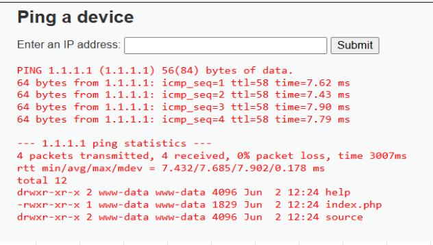

import LinuxTerminal from '@site/src/components/LinuxTerminal';

# Command Injection — Low

Voor **Command Injection** is het belangrijk dat we ons eerst verdiepen in het systeemcommando `ping`.

## 1. Predict (Voorspel)

Kijk eens naar de volgende (vereenvoudigde) code die wordt gebruikt om een IP-adres te pingen:

```php
$target = $_REQUEST[ 'ip' ];
$cmd = shell_exec( 'ping -c 4 ' . $target );
echo $cmd;
```

<details>
<summary>Hulp bij PHP syntax</summary>

- `shell_exec()`: Dit vertelt de webserver om een commando uit te voeren op het onderliggende besturingssysteem (Linux), alsof je het zelf in de terminal typt.
- `.` (punt): Plakt de variabele `$target` direct achter de tekst `ping -c 4 `.
</details>

**Vraag:** Wat denk je dat dit script doet als een gebruiker de volgende tekst invult bij het IP-adres: `127.0.0.1; whoami`?

<details>

<summary>Antwoord</summary>

Het systeem stuurt testpakketjes (netwerkverkeer) naar het IP-adres (127.0.0.1 is het adres van de server zelf) om te kijken of het doelwit bereikbaar is. De terminal geeft tekst terug met de resultaten van die test.

</details>

## 2. Run (Uitvoeren)

Oefen het ping-commando in de terminal hieronder. Typ `ping 127.0.0.1` en bekijk de output.

<LinuxTerminal title="Command Injection — Low (geen filter)" />

## 3. Investigate (Onderzoeken)

Je hebt zojuist gepingd. Maar we zijn hier om te hacken.

**Vraag:** Hoe kun je in een Linux-terminal twee afzonderlijke commando's op exact dezelfde regel achter elkaar uitvoeren?

<details>

<summary>Tip</summary>

Kijk op je [Cheatsheet](../../docs/cheatsheet) onder "Linux Commando's". Er is een specifiek leesteken dat als "scheidingsteken" werkt.

</details>

<details>

<summary>Antwoord</summary>

Je kunt de puntkomma (`;`) of de dubbele ampersand (`&&`) gebruiken. Bijvoorbeeld: `commando1 ; commando2`.

</details>

## 4. Modify & Make (Aanpassen & Maken)

Probeer nu een invoer die `ping` combineert met een tweede Linux-commando (zoals `ls` of `whoami`). Oefen eerst in de terminal hieronder:

<LinuxTerminal title="Command Injection — Low (geen filter)" />

Werkt het in de terminal? Probeer het nu ook op DVWA:

1. Start `DVWA` in je Kali-omgeving en ga naar de challenge `Command Injection`.
2. Zorg dat je `DVWA Security` op **low** hebt staan. (Vergeten hoe dit moet? Ga dan naar de [cheatsheet](../../docs/cheatsheet)).
3. Vul je payload in het invulveld in en klik op **Submit**.

<details>

<summary>Tip</summary>

De webserver plakt jouw invoer achter het woord `ping`. Als jij `127.0.0.1; ls` typt, voert de server `ping 127.0.0.1; ls` uit.

</details>

<details>

<summary>Antwoord</summary>

Vul in: `127.0.0.1; ls`

Het resultaat van een succesvolle poging (je ziet de bestanden van de server!) zie je hieronder:



</details>

## 5. ✓ Wat moest je zien?

:::tip Controle
- Na `127.0.0.1; ls` zie je **twee blokken output**: eerst de ping-resultaten, daarna een **bestandslijst** van de server.
- De bestandslijst bevat PHP-bestanden zoals `index.php` — echte serverbestanden.
- Geen rode foutmelding.

Zie je alleen ping-output zonder bestandslijst? Controleer of je de puntkomma (`;`) correct hebt getypt en op **Submit** hebt geklikt.
:::

## 6. Er gaat iets mis...

Wat gebeurt er als je alleen `; ls` invult (zonder IP-adres ervoor)?
Je krijgt waarschijnlijk een melding zoals `ping: usage error`. Omdat de linkerkant van de puntkomma niet klopt (een ping zonder adres), mislukt de ping. Echter, in Linux wordt het commando áchter de puntkomma vaak tóch uitgevoerd! Bij gebruik van `&&` stopt Linux wél direct als het eerste deel faalt.

## Walkthrough

Kom je er niet uit? Bekijk dan deze walkthrough:

<iframe width="920" height="517" src="https://www.youtube.com/embed/WiqRvlN_UIU?start=9" title="2 - Command Injection (low/med/high) - Damn Vulnerable Web Application (DVWA)" frameborder="0" allow="accelerometer; autoplay; clipboard-write; encrypted-media; gyroscope; picture-in-picture; web-share" referrerpolicy="strict-origin-when-cross-origin" allowfullscreen></iframe>
