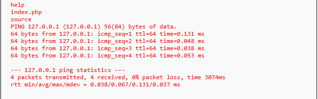

import LinuxTerminal from '@site/src/components/LinuxTerminal';
import { Filters } from '@site/src/components/LinuxTerminal/commands';

# Command Injection — Medium

De aanvaller heeft ons door. Op de Medium-beveiliging kunnen we niet meer zomaar `&&` of `;` gebruiken.

## 1. Predict (Voorspel)

De programmeur heeft besloten om de invoer veiliger te maken. Er wordt nu een "filter" (blacklisting) toegepast.

**Vraag:** Wat gebeurt er onder water met jouw commando als jij `127.0.0.1; ls` of `127.0.0.1 && ls` intypt?

Antwoord

Het filter zoekt naar exact de tekens `;` en `&&` en haalt deze weg.
Jouw invoer `127.0.0.1; ls` verandert dus in `127.0.0.1 ls`. Omdat dit geen geldig commando is voor de server, zal de injection mislukken en krijg je hooguit een ping-error.

## 2. Run & Investigate

Probeer je Low-payload in de terminal hieronder — de filter is actief en haalt `&&` en `;` weg. Kun je een andere manier vinden om twee commando's uit te voeren?

<LinuxTerminal
  title="Command Injection — Medium (&& en ; gefilterd)"
  filter={Filters.medium}
/>

Wat zouden we kunnen gebruiken zodat de filter het mist, maar Linux toch doorgaat met het uitvoeren van ons tweede commando?

Tip

De programmeur is vergeten álle mogelijke scheidingstekens in Linux te blokkeren. Kijk nog eens naar de Linux sectie op je [Cheatsheet](/docs/cheatsheet). Welk leesteken is een verticaal streepje?

Antwoord

De pipe-operator `|` wordt niet gefilterd. De logische OR `||` glipt ook langs het filter, maar let op: `||` voert het tweede commando alléén uit als het eerste **mislukt**. Omdat `ping 127.0.0.1` gewoon slaagt, draait `ls` daar juist niet. Voor deze aanval is `|` dus de betrouwbare keuze.

## 3. Modify & Make

Probeer de `|` operator in de terminal hieronder om te bevestigen dat het werkt:

<LinuxTerminal
  title="Command Injection — Medium (&& en ; gefilterd)"
  filter={Filters.medium}
/>

Werkt het? Probeer het nu op DVWA:

1. Start `DVWA` en ga naar de challenge `Command Injection`. Zorg dat je `DVWA Security` op **medium** hebt staan.
2. Vul je payload in en klik op **Submit**.

Tip

Probeer de pipe operator direct na het IP-adres te zetten.

Antwoord

Vul in: `127.0.0.1 | ls`

Het resultaat van een succesvolle poging zie je hieronder:

## 4. ✓ Wat moest je zien?

:::tip[Controle]
- Na `127.0.0.1 | ls` verschijnt een **bestandslijst** — de ping-output ontbreekt, dat is normaal bij `|`.
- Je eerdere payloads met `&&` of `;` geven géén tweede output meer.
- De `|`-operator omzeilt het filter wél.

Werkt `|` toch niet? Controleer of `DVWA Security` op **medium** staat en dat er geen typfout in je payload zit.
:::

## 5. Er gaat iets mis...

Je typt vol goede moed `127.0.0.1 | ls` in en je ziet ineens... géén ping-resultaat meer. Alleen de lijst met bestanden. Waarom zie je de ping-output niet?

Dit is de werking van de pipe (`|`). Een pipe pakt de onzichtbare output van het eerste commando (de ping) en duwt die als invoer in het tweede commando (`ls`). Het `ls`-commando doet niets met die invoer; het print de huidige map. Daardoor verdwijnt de ping-tekst in het niets.

En `||` dan? Dat is een valkuil. `A || B` voert `B` alleen uit als `A` mislukt. `ping 127.0.0.1` slaagt gewoon, dus `127.0.0.1 || ls` laat `ls` juist níét draaien — je ziet alleen de ping. Wil je `||` zien werken, geef dan een adres dat faalt, bijvoorbeeld `1 || ls`: nu mislukt de ping en verschijnt de bestandslijst.
