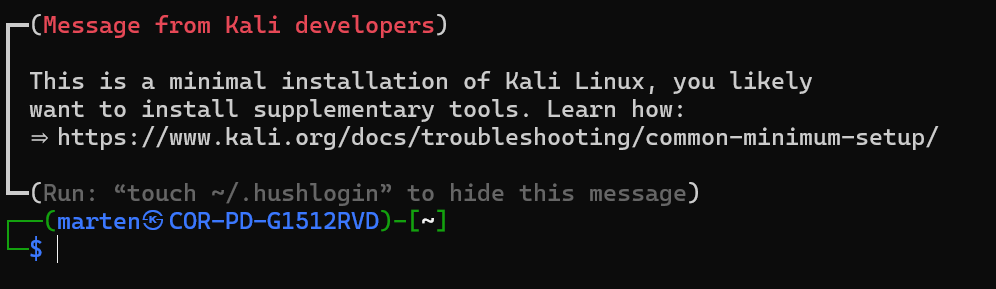

# WSL installeren

Voordat je met DVWA aan de slag kunt, heb je een Linux-omgeving nodig. Op Windows regelen we dat met **WSL** (Windows Subsystem for Linux). Daarmee draait Linux gewoon naast Windows, zonder dat je een aparte virtuele machine hoeft op te zetten.

In deze handleiding installeer je WSL en zet je daar **Kali Linux** op — een Linux-distributie die speciaal is gemaakt voor cybersecurity-werk.

## Stap 1: PowerShell openen als administrator

Zoek op je computer naar `Windows PowerShell` en kies ervoor om deze als **administrator** uit te voeren. Zonder administratorrechten kun je de volgende commando's niet draaien.

## Stap 2: De benodigde Windows-onderdelen aanzetten

Kopieer het volgende commando, plak het in PowerShell en druk op Enter:

```powershell
dism.exe /online /enable-feature /featurename:Microsoft-Windows-Subsystem-Linux /all /norestart
```

Dit zet het onderdeel **Windows Subsystem for Linux** aan.

Voer daarna het tweede commando uit:

```powershell
dism.exe /online /enable-feature /featurename:VirtualMachinePlatform /all /norestart
```

Hiermee zet je het **Virtual Machine Platform** aan dat WSL nodig heeft.

## Stap 3: Je computer herstarten

Start je computer opnieuw op zodat de nieuwe instellingen actief worden.

## Stap 4: Controleren of WSL klaar is

Open `Windows PowerShell` opnieuw als administrator en voer uit:

```powershell
wsl --status
```

Als het goed is zie je onder andere deze regel staan:

```
Standaardversie: 2
```

Zie je dat niet? Dan is WSL waarschijnlijk nog niet geïnstalleerd. Draai dan dit commando:

```powershell
wsl.exe --install
```

## Stap 5: Kali Linux installeren

Open opnieuw `Windows PowerShell` als administrator en draai:

```powershell
wsl --install kali-linux
```

**Let op:**

1. Als je een wachtwoord moet typen in Linux, zie je geen sterretjes of bolletjes verschijnen. Dat is normaal — wat je typt wordt wel onthouden.
2. Je wordt gevraagd om een **gebruikersnaam** en **wachtwoord** te kiezen. Onthoud deze goed, want die heb je later nodig.

## Stap 6: Controleren of Kali Linux werkt

Open `Windows PowerShell` (administrator hoeft niet meer) en typ:

```powershell
wsl -d kali-linux
```

Je komt nu in de Kali Linux-shell terecht. Als het goed is lijkt je scherm op deze:



Gelukt? Dan kun je verder met het installeren van DVWA.
