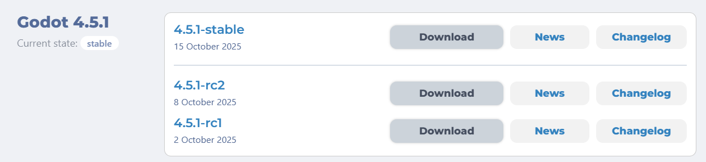
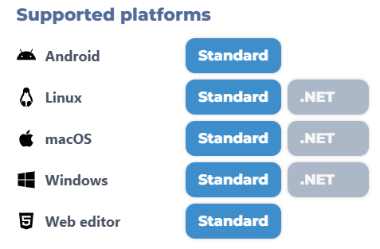
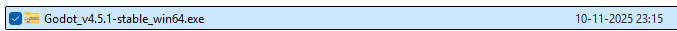
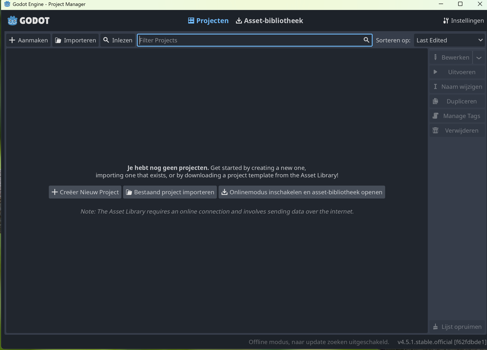

# Installatie

Voordat je je eerste game kunt bouwen, heb je de Godot-editor nodig. Dat is het programma waarin je je scènes tekent en je code schrijft. Op deze pagina installeer je Godot 4 op je eigen computer.

:::info[Godot 4.5]
Deze cursus is geschreven voor **Godot 4.5.x**. UI-elementen kunnen iets afwijken in latere versies — zie [Godot-versies](/docs/godot-versies) voor compatibiliteit.
:::

:::note[Chromebook]
Op een Chromebook kun je geen programma's installeren. Gebruik in dat geval de **online editor** in je browser: [editor.godotengine.org](https://editor.godotengine.org/). Je kunt daar direct beginnen. Sla je project op door het te exporteren als zip. De rest van de handleiding werkt hetzelfde.
:::

## Stap 1: De editor downloaden

Ga naar [godotengine.org/download/archive](https://godotengine.org/download/archive/) en zoek de nieuwste versie die begint met `4.5.` (bijvoorbeeld `4.5.1-stable` of nieuwer binnen de 4.5-lijn).

Klik op **Download**, zoek het kopje **Windows** en klik op **Standard**.

## Stap 2: Uitpakken

In je `Downloads`-map vind je nu een zip-bestand:

Dubbelklik erop en kies bovenaan voor **Alles uitpakken**. Verplaats de uitgepakte bestanden naar een vaste map op je computer waar je ze later snel terugvindt (bijvoorbeeld `Documenten\Godot\`).

## Stap 3: De editor openen

Dubbelklik op het Godot-bestand (de bestandsnaam ziet er ongeveer zo uit: `Godot_v4.5.x-stable_win64.exe`). Godot opent en je belandt in het **Project Manager**-venster:

## Stap 4: Check je versie

Open in Godot het menu **Help → About Godot**. Er verschijnt een venster met de exacte versie. Controleer dat het versienummer begint met `4.5.` — bijvoorbeeld `4.5.1` of `4.5.2`. Als je een andere versie ziet, ga terug naar Stap 1 en download de juiste.

In de volgende les maak je je eerste project aan.

## Er gaat iets mis

Bij het openen van Godot krijg ik een DLL-fout / "kan niet starten"

**Oorzaak:** Op oudere Windows-installaties ontbreekt de Visual C++ runtime die Godot nodig heeft.

**Oplossing:**

1. Download "Visual C++ Redistributable for Visual Studio" via [aka.ms/vs/17/release/vc_redist.x64.exe](https://aka.ms/vs/17/release/vc_redist.x64.exe).
2. Installeer dat bestand.
3. Probeer Godot opnieuw te openen.

Mijn antivirus blokkeert het bestand

**Oorzaak:** Windows Defender of een ander antivirusprogramma kent het uitvoerbare bestand niet en blokkeert het uit voorzorg.

**Oplossing:**

- Controleer dat je het bestand echt via [godotengine.org](https://godotengine.org/download/) hebt gedownload (niet een willekeurige andere site).
- In Windows: klik in de melding op **Meer informatie** → **Toch uitvoeren**, of voeg `Godot_v4.5.1-stable_win64.exe` toe als uitzondering in Windows Defender.

Ik kan het uitgepakte bestand niet vinden

**Oorzaak:** Het bestand staat nog in `Downloads`, of is uitgepakt in een dubbele submap (`Godot_v4.5.../Godot_v4.5.../...`).

**Oplossing:**

1. Open Verkenner en zoek op `Godot_v4.5`.
2. Verplaats het `.exe`-bestand naar een vaste map, bijvoorbeeld `Documenten\Godot\`.
3. Maak eventueel een snelkoppeling op je bureaublad: rechts-klikken → **Verzenden naar** → **Bureaublad**.

