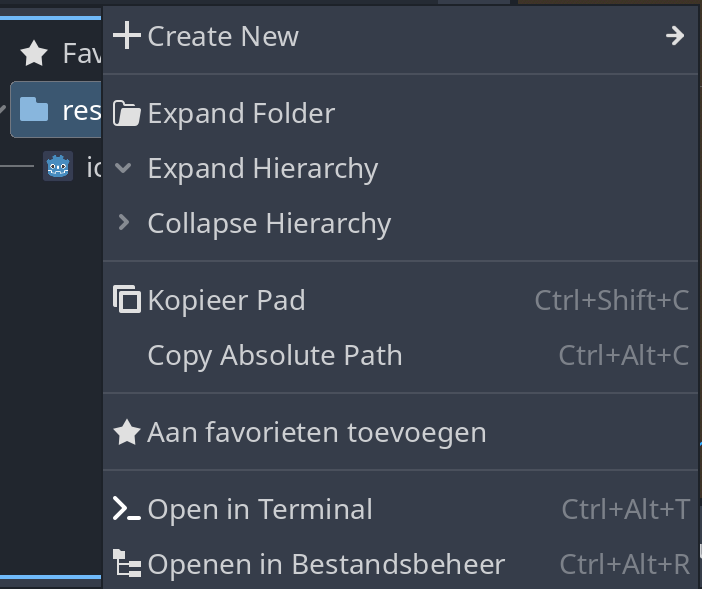

# Bestanden downloaden

Voor je spel heb je afbeeldingen nodig: een achtergrond, een karakter, vijanden, muntjes. Die afbeeldingen noemen we **assets**. Je hoeft ze niet zelf te tekenen — voor deze cursus gebruiken we een gratis asset-pack van internet.

<GodotVersie />

## Stap 1: Download het asset-pack

1. Open [pixelfrog-assets.itch.io/pixel-adventure-1](https://pixelfrog-assets.itch.io/pixel-adventure-1).
2. Klik op **Download Now**.
3. Je krijgt een scherm waar je een bedrag kunt invullen. Het pack is gratis — klik op **No thanks, just take me to the downloads**.
4. Klik op **Download** naast het bestand.

Een `.zip`-bestand wordt nu naar je `Downloads`-map gedownload.

## Stap 2: Uitpakken

1. Ga in de Verkenner naar je `Downloads`-map.
2. Dubbelklik op het `.zip`-bestand.
3. Klik bovenaan op **Alles uitpakken**.
4. Kies een locatie en klik op **Uitpakken**.

:::note
Op Windows 11 kun je bestanden direct uit een zip slepen zonder eerst uit te pakken. Dat werkt ook.
:::

Je hebt nu een map met alle afbeeldingen uit het pack.

## Stap 3: Kopieer naar je projectmap \{#projectmap}

Godot ziet alleen bestanden die **in je projectmap** staan. Vanuit de editor kun je die map snel openen.

1. Open je project in Godot.
2. Klik met de **rechtermuisknop** op `res://` in het **FileSystem**-paneel (linksonder).
3. Kies **Open in File Manager** (heet **Openen in Bestandsbeheer** als je editor Nederlands is) — Verkenner opent nu je projectmap.

4. Open in een tweede Verkenner-venster de uitgepakte asset-map.
5. Maak in je projectmap een nieuwe map `assets` en sleep de mappen die je nodig hebt (bijvoorbeeld `Background`) daarin. In latere lessen verwijzen we naar deze `assets`-map.

:::tip
Je hoeft niet alles te kopiëren. Voor de achtergrond heb je alleen de map `Background` nodig. Later kun je altijd meer toevoegen.
:::

Ga terug naar Godot — de bestanden verschijnen automatisch in het FileSystem-paneel.

:::note[Chromebook / online editor]
Gebruik je de [online editor](https://editor.godotengine.org/)? Dan kun je geen bestanden via de Verkenner kopiëren. Sleep de uitgepakte bestanden in plaats daarvan rechtstreeks naar het **FileSystem**-paneel in de editor.
:::

## Voorspel: wat betekent `res://`?

Bovenaan het FileSystem-paneel staat `res://`. **Wat denk je dat dat is?** Denk terug aan [Opdracht 1.2.a](../01-aan-de-slag/project.md#opdracht-12a-vind-je-projectmap-terug), waar je je projectmap opzocht in de Verkenner.

Antwoord

`res://` is je **projectmap**, gezien vanuit Godot. `res` staat voor *resources*: alle bestanden van je project. Een pad als `res://assets/Background/Green.png` betekent dus: het bestand `Green.png`, in de map `assets/Background`, binnen je projectmap. Zo kan een project verwijzen naar zijn eigen bestanden, op welke computer het ook staat.

## Opdracht 2.3.a: verken het asset-pack

Je gaat de komende hoofdstukken steeds bestanden uit dit pack gebruiken. Kijk nu alvast wat erin zit. Zoek in het FileSystem-paneel (of in de Verkenner) op:

1. Welke kleuren achtergrond de map `Background` bevat.
2. Waar de speelbare figuren staan, en hoe hun loop-animatie als bestand is opgeslagen.

Klik hier voor een tip.

Klap de mappen in het FileSystem-paneel open met het pijltje ervoor. Klik op een afbeelding om rechtsonder een voorbeeld te zien.

Klik hier voor de oplossing.

1. `Background` bevat effen kleurtegels, waaronder `Green.png` — die gebruik je in [Achtergrond](../03-level-bouwen/background_image.md).
2. De figuren staan in `Main Characters`, elk in een eigen map. Een animatie is één breed bestand zoals `Run (32x32).png`: alle stapjes van de beweging naast elkaar in een **sprite-sheet**. In hoofdstuk 5 knip je die frames in Godot los.

## Er gaat iets mis

Ik zie de bestanden niet in Godot

**Oorzaak:** De bestanden staan niet in je projectmap. Godot toont alleen bestanden die in dezelfde map staan als `project.godot`.

**Oplossing:**

1. Zoek in de Verkenner waar je `project.godot`-bestand staat — dat is je projectmap.
2. Kopieer de gedownloade bestanden naar die map.
3. Ga terug naar Godot — de bestanden verschijnen automatisch.

Ik heb een map-in-een-map (dubbele map)

**Oorzaak:** Bij het uitpakken wordt soms een extra map aangemaakt. Je krijgt dan bijvoorbeeld `Pixel Adventure 1/Pixel Adventure 1/...`.

**Oplossing:** Open de buitenste map en kopieer de **binnenste** map (of de bestanden daarin) naar je projectmap.

