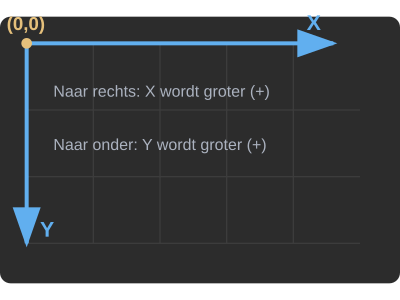

# Het bewegingsscript bouwen — Deel 7: Springen

Je karakter loopt en valt. Er ontbreekt één ding: omhoog. In deze les maak je het bewegingsscript af.

<GodotVersie />

<GDQuestLes slug="movement-afsluiter" />

<Voorkennis
  items={[
    {site: 'python', to: '/docs/beslissen/05c-and-or-elif', label: 'And, or en elif'},
  ]}
/>

## Wat je nu gaat toevoegen

Twee begrippen: het verschil tussen **`just_pressed`** en **`pressed`**, en **`and`** om twee voorwaarden te combineren. Daarna is je bewegingsscript compleet en heb je het helemaal zelf getypt.

## Voorspel: waarom is springen negatief? \{#springen}

Springen betekent `velocity.y` een waarde geven. **Moet dat een positief of een negatief getal zijn?**

<details>
<summary>Antwoord</summary>

Negatief. In Godot ligt `(0, 0)` in de **linkerbovenhoek** van het scherm:

- naar rechts wordt `x` groter
- naar beneden wordt `y` groter
- naar boven wordt `y` dus **kleiner**, en dat betekent negatief

Een sprong is beweging naar boven, dus `velocity.y` moet negatief worden.



</details>

## Stap 1: De sprongkracht als constante

Zet deze regel onder je bestaande `const SPEED`:

```gdscript
const JUMP_VELOCITY = -400.0
```

Een negatief getal, precies zoals je voorspelde. Hoe verder van nul, hoe hoger de sprong.

## Stap 2: De sprong zelf

Zet dit binnen de functie, ónder het zwaartekracht-blok en bóven de regels voor lopen:

```gdscript
    if Input.is_action_just_pressed("ui_accept") and is_on_floor():
        velocity.y = JUMP_VELOCITY
```

`ui_accept` is een standaardactie van Godot, gekoppeld aan de spatiebalk en Enter.

## Stap 3: `just_pressed` of `pressed`?

Godot heeft twee manieren om naar een toets te kijken:

| Functie                                     | Wanneer is het `true`?                              |
| :------------------------------------------ | :--------------------------------------------------- |
| `Input.is_action_pressed("ui_accept")`      | zolang je de toets **ingedrukt houdt**               |
| `Input.is_action_just_pressed("ui_accept")` | alleen op het ene frame dat je hem **indrukt**       |

**Wat denk je dat er gebeurt als je `just_pressed` vervangt door `pressed`?**

<details>
<summary>Antwoord</summary>

Je karakter stuitert continu omhoog zolang je de spatie vasthoudt. Elke frame voldoet `pressed` aan de check, dus elke frame krijgt hij opnieuw de volle sprongkracht. Hij komt nooit meer naar beneden.

Met `just_pressed` gebeurt het één keer per druk, en moet de speler loslaten voor een volgende sprong.

</details>

Het verschil staat ook in de [GDScript-tips](/gdscript-tips#input).

## Stap 4: Twee voorwaarden met `and`

De check bestaat uit twee delen: de speler drukt op de knop **en** het karakter staat op de grond. Met `and` moeten ze allebei waar zijn.

**Wat gebeurt er zonder dat tweede deel?**

<details>
<summary>Antwoord</summary>

Je kunt in de lucht springen. Tijdens een sprong nog eens drukken geeft opnieuw de volle sprongkracht, en zo kun je jezelf omhoog blijven pompen. Elk gat is dan over te steken en je level wordt betekenisloos.

</details>

## Stap 5: `=` en niet `+=`

Bij de zwaartekracht gebruikte je `+=`, hier gebruik je `=`. Dat is bewust.

**Je karakter valt al met `velocity.y = 200`. Wat gebeurt er als je hier `velocity.y += JUMP_VELOCITY` schrijft?**

<details>
<summary>Antwoord</summary>

Dan wordt het `200 + (-400) = -200`: je springt half zo hoog, alleen omdat je toevallig al aan het vallen was.

Met `=` vervang je de verticale snelheid volledig door `-400`. Een sprong is dan altijd even hoog, en dat voelt voorspelbaar.

</details>

## Stap 6: Test het

Start met `F5`. Je karakter loopt, springt met de spatiebalk, valt terug en kan niet in de lucht nog een keer springen.

Je bewegingsscript is compleet — en je hebt geen regel gekregen die je niet zelf hebt getypt.

## Hoe anderen dit doen

Zoek je straks zelf een tutorial op, dan zie je vaak een andere route: veel makers laten Godot het bewegingsscript invullen met de kant-en-klare template, en passen daarna wat getallen aan. Sneller, maar je slaat het begrijpen over.

Nu je je eigen versie hebt, kun je zo'n video met winst bekijken: je herkent elke regel en je ziet meteen waar iemand iets anders doet dan jij.

<iframe width="100%" height="500px" src="https://www.youtube-nocookie.com/embed/5V9f3MT86M8?start=570&end=712" title="Start Your Game Creation Journey Today. (Godot beginner tutorial)" frameborder="0" allow="accelerometer; autoplay; clipboard-write; encrypted-media; gyroscope; picture-in-picture; web-share" referrerpolicy="strict-origin-when-cross-origin" allowfullscreen></iframe>

## Je complete script

```gdscript
extends CharacterBody2D

const SPEED = 300.0
const JUMP_VELOCITY = -400.0

func _physics_process(delta: float) -> void:
    if not is_on_floor():
        velocity += get_gravity() * delta

    if Input.is_action_just_pressed("ui_accept") and is_on_floor():
        velocity.y = JUMP_VELOCITY

    var direction := Input.get_axis("ui_left", "ui_right")
    if direction:
        velocity.x = direction * SPEED
    else:
        velocity.x = move_toward(velocity.x, 0, SPEED)

    move_and_slide()
```

<details>
<summary>Klik om WASD-besturing toe te voegen (W = springen, A = links, D = rechts)</summary>

Veel platformers laten je naast de pijltjestoetsen ook met WASD spelen. Dat doe je door **extra toetsen te koppelen aan bestaande acties**, zonder de pijltjestoetsen te slopen.

**Stap 1 — Open de Input Map**

1. Klik bovenin op **Project → Project Settings**.
2. Klik op het tabblad **Input Map** (naast *General*).
3. In de lijst onder *All Actions* staan `ui_accept`, `ui_left`, `ui_right` en meer. Klap een actie open met het pijltje ervoor om de huidige toetsen te zien.

**Stap 2 — Voeg W toe aan `ui_accept`**

1. Zoek `ui_accept` en klik op het **plus-icoontje (+)** ernaast.
2. Er verschijnt een venster: druk op de **W**-toets.
3. Klik op **OK**.

**Stap 3 — Doe hetzelfde voor A en D**

Bij `ui_left`: klik **+**, druk **A**, klik **OK**. Bij `ui_right`: klik **+**, druk **D**, klik **OK**.

**Stap 4 — Test**

Start met `F5`. WASD en de pijltjestoetsen werken nu allebei.

:::tip
Een toets juist vervangen in plaats van toevoegen? Klap de actie open en klik op het prullenbak-icoontje naast de toets die weg mag.
:::

</details>

## Opdracht 4.4.d: voeg een eigen kracht toe

Je script kent nu vallen, lopen en springen. Voeg er zelf iets bij dat niet in de les staat. Kies er één:

- **Sprinten**: houd shift ingedrukt en je loopt sneller.
- **Dubbel springen**: één keer extra springen terwijl je in de lucht bent.

:::info
Dit is de eerste opdracht zonder uitgewerkte oplossing, en dat is met opzet. Tot nu toe kon je je antwoord vergelijken met het onze. Vanaf hier gaat het erom dat je zelf iets bedenkt met wat je kent — een oplossing die je overschrijft leert je iets anders dan een oplossing die je vindt.
:::

## Denk na

Beantwoord deze vragen voor jezelf voordat je gaat typen. Ze wijzen allebei de weg.

**Bij sprinten:**

- Welke waarde moet er anders zijn als shift ingedrukt is? En welke regel zet die waarde nu?
- Je hebt een actie nodig die "shift" heet. Waar maak je die aan? (Zie het WASD-blok hierboven.)

**Bij dubbel springen:**

- Je moet onthouden hóé vaak er al gesprongen is sinds de laatste landing. Een `const` kan dat niet bijhouden — wat wel?
- Waar in je functie weet je zeker dat het karakter net geland is?

<details>
<summary>Vastgelopen?</summary>

Bouw het in twee helften. Zorg eerst dat je in **Uitvoer** kunt zien dat je nieuwe toets wordt herkend, met een `print()`. Werkt dat, dan pas de snelheid of de sprong aanpassen.

Zo weet je bij een fout meteen aan welke kant je moet zoeken: bij het uitlezen van de toets, of bij het toepassen ervan.

</details>

## Er gaat iets mis

<details>
<summary>Mijn karakter springt niet</summary>

**Oorzaak:** De `if` staat op het verkeerde niveau, of `ui_accept` is niet aan een toets gekoppeld.

**Oplossing:**

1. Controleer dat de `if`-regel op hetzelfde niveau staat als de andere regels binnen de functie.
2. Controleer in **Project → Project Settings → Input Map** dat `ui_accept` bestaat en aan de spatiebalk hangt.
3. Zet `print("spring")` binnen de `if` om te zien of hij überhaupt wordt bereikt.

</details>

<details>
<summary>Mijn karakter springt oneindig hoog of blijft hangen</summary>

**Oorzaak:** `is_action_pressed` in plaats van `is_action_just_pressed`, of de `and is_on_floor()` ontbreekt.

**Oplossing:** Vergelijk je regel letterlijk met die uit Stap 2.

</details>

<details>
<summary>Mijn sprong voelt elke keer anders</summary>

**Oorzaak:** Je gebruikt `+=` in plaats van `=` bij `velocity.y`.

**Oplossing:** Gebruik `velocity.y = JUMP_VELOCITY`. Zie Stap 5 voor waarom.

</details>

---

← [Deel 6 — Stoppen](./remmen.md) · **Volgende:** [Fouten zoeken](../fouten-zoeken.md) →
