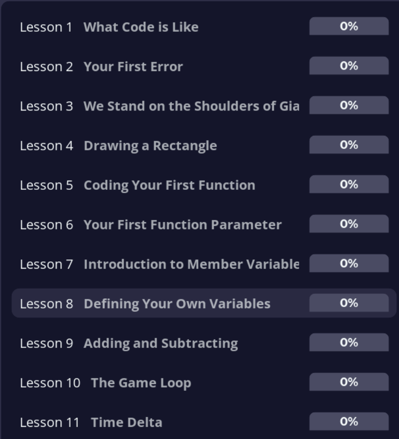
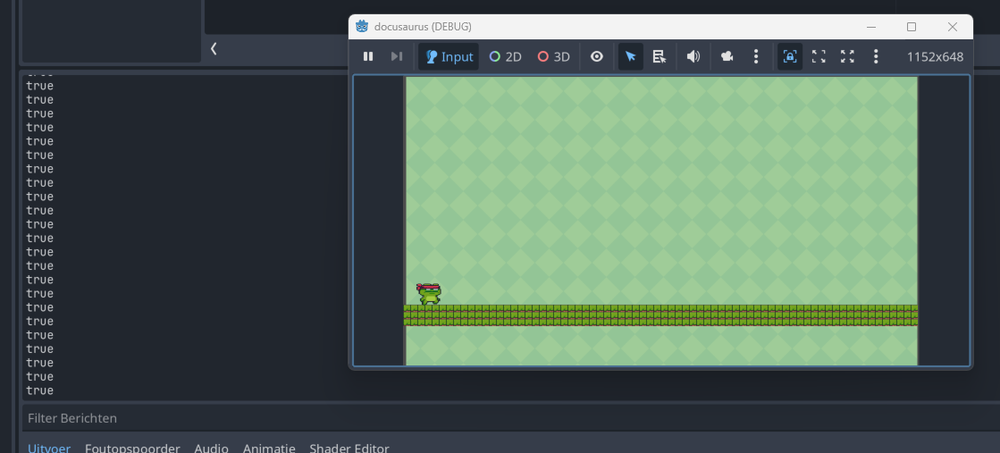

# Start met GDScript

Je hebt nu een werkende scène met een bewegend karakter. Maar om je spel echt te laten doen wat *jij* wilt, moet je leren programmeren in **GDScript** — de programmeertaal van Godot. In deze les leer je de bouwstenen.

:::info[Godot 4.5]
Geschreven voor **Godot 4.5.x** — zie [Godot-versies](/docs/godot-versies) voor compatibiliteit.
:::

## Waarom GDScript?

Het script dat Godot in de vorige les voor je genereerde, is ook gewoon GDScript. In de komende lessen ga je dat script begrijpen en uitbreiden.

## Wat ga je leren?

Dit zijn de GDScript-concepten die je in dit project nodig hebt:

| Concept       | Waarvoor gebruik je het?                                                    |
| :-----------: | :-------------------------------------------------------------------------- |
| `var`         | Informatie opslaan (bijvoorbeeld snelheid, score)                           |
| `const`       | Vaste waarden die niet veranderen (bijvoorbeeld `SPEED`)                    |
| `if` / `else` | Beslissingen nemen ("als op de grond, dan springen")                        |
| `elif`        | Meerdere voorwaarden na elkaar testen                                       |
| `func`        | Code groeperen in een herbruikbare functie                                  |
| `print()`     | Waarden bekijken tijdens het testen                                         |

## Stap 1: Doe de online tutorial

We volgen [deze interactieve tutorial van GDQuest](https://gdquest.github.io/learn-gdscript/) om de basis te leren. Je werkt direct in je browser — niets te installeren.

Maak de volgende lessen — de afbeelding hieronder laat zien welke je nodig hebt:



:::tip
Je hoeft niet alle lessen te maken. Focus op:

- **Variabelen** (`var`)
- **Functies** (`func`)
- **Voorwaarden** (`if` / `elif` / `else`)
- **Vergelijkingsoperatoren** (`==`, `>`, `<`)
- **`print()`**

Die dekken precies wat je in dit project gebruikt.
:::

## Stap 2: Test het in je eigen project

De GDQuest tutorial is handig om de syntax te leren, maar het wordt pas écht leuk als je het in je eigen game ziet werken.

1. Open in Godot het script van je karakter (`CharacterBody2D`).
2. Voeg de `_ready()`-functie toe. Deze functie wordt één keer uitgevoerd zodra het spel start.
3. Maak binnen die functie een variabele aan en gebruik `print()`:

```gdscript
func _ready() -> void:
    var levens = 3
    print("Het spel is gestart!")
    print("Ik heb ", levens, " levens.")
```

4. Druk op `F5` om je spel te starten.
5. Kijk onderin je Godot-scherm op het tabblad **Uitvoer** (of **Output**). Je tekst verschijnt daar:



We gaan dit Uitvoer-tabblad later vaak gebruiken om foutjes op te sporen.

## Check je begrip: `_ready()` versus `_process()`

**Wat denk je dat er gebeurt als je `_ready()` vervangt door `_process(delta)`?**

<details>
<summary>Antwoord</summary>

`_ready()` draait één keer bij start. `_process(delta)` draait **elke frame** (~60 keer per seconde). Je Uitvoer-tabblad raakt dan in een paar seconden vol met dezelfde regel. Handig om bewegende waardes te volgen, niet handig voor een eenmalige startmelding.

</details>

## Er gaat iets mis

<details>
<summary>Ik krijg een SyntaxError bij `_ready()`</summary>

**Oorzaak:** Verkeerde indentatie of de `:` aan het einde van de functie-regel is vergeten.

**Oplossing:**

1. Zorg dat `func _ready() -> void:` op een dubbele punt eindigt.
2. Alle regels die *bij* de functie horen, moeten ingesprongen zijn met een tab of vier spaties — niet mengen.
3. Lege regels in de functie zijn prima; mengen van tabs en spaties is dat niet.

</details>

<details>
<summary>Ik zie geen output in het Uitvoer-tabblad</summary>

**Oorzaak:** Het spel is niet gestart, of het Uitvoer-tabblad staat dicht.

**Oplossing:**

1. Druk op `F5` om het spel te starten.
2. Klik onderin op het tabblad **Uitvoer** (Engels: **Output**) — soms staat het verstopt naast **Debugger** of **Audio**.
3. Geen `F5`-knop? Stel eerst een Main Scene in via **Project → Project Settings → Run → Main Scene** ([zie Je eerste 2D-scène](../02-editor-leren-kennen/scene.md)).

</details>

## Wat daarna?

In de volgende les ([Het bewegingsscript begrijpen](./basis_movement_begrijpen/skelet.md)) ga je het bewegingsscript regel voor regel ontleden en aanpassen. Je hoeft de tutorial niet perfect te kennen — als je de bovenstaande concepten globaal beheerst, kom je een heel eind.
