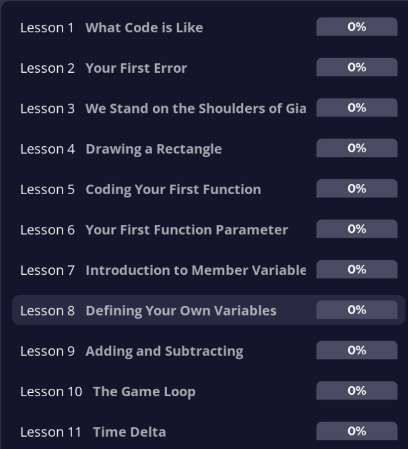
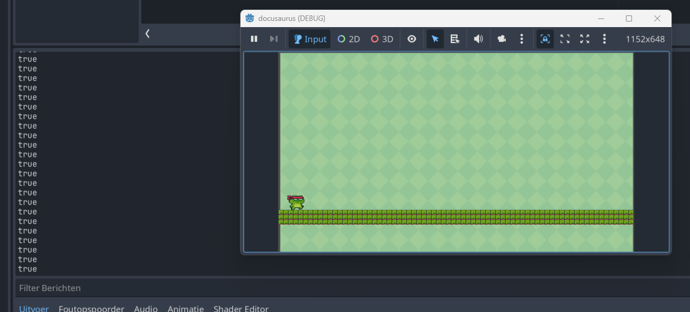

# Start met GDScript

Je karakter staat op het scherm en je hebt een leeg script gekoppeld. Vanaf hier ga je dat script vullen met **GDScript**, de programmeertaal van Godot. Deze les regelt eerst je oefenspoor ernaast.

<GodotVersie />

<Voorkennis
  items={[
    {site: 'python', to: '/docs/basis/jij-als-variabele', label: 'Variabelen'},
    {site: 'python', to: '/docs/basis/jouw-naam-op-het-scherm', label: 'Print'},
    {site: 'python', to: '/docs/beslissen/05b-if-else', label: 'If en else'},
    {site: 'python', to: '/docs/functies/functies', label: 'Functies'},
  ]}
/>

## Twee sporen naast elkaar

Programmeren leer je door het te doen, maar in je eigen game oefenen is lastig: als er iets niet werkt, weet je niet of het aan je code ligt of aan je scène.

Daarom loop je twee sporen tegelijk:

- **Hier** bouw je je game. Elke les voegt regels toe aan een script dat je zelf typt, en aan het eind van de les draait je spel weer.
- **Bij GDQuest** oefen je elk concept los, in je browser, zonder Godot erbij. Gaat het daar mis, dan ligt het aan de code — meer kan het niet zijn.

In elke les hieronder staat bij de regel die je net hebt geschreven welke GDQuest-les erbij hoort. Zo zie je meteen waar je iets kunt naslaan of extra kunt oefenen.

## Stap 1: Open de GDQuest-cursus

Ga naar [Learn GDScript From Zero](https://gdquest.github.io/learn-gdscript/). Je werkt direct in je browser en hoeft niets te installeren.

Je ziet een lijst met genummerde lessen:



Begin met les 1 en 2. Die kosten samen een kwartier en leggen uit wat code is en hoe je een foutmelding leest — precies wat je nodig hebt zodra je zelf gaat typen.

## Wat je waar tegenkomt

Elke les hier gaat over één of twee begrippen, en begint met een blok dat zegt welke GDQuest-les datzelfde begrip los oefent. Dit is het overzicht:

<GDQuestTabel />

Alles hieruit staat kort bij elkaar in de [GDScript-tips](/gdscript-tips), de naslag bij alle lessen.

## Stap 2: Schrijf je eerste eigen regels

Voordat je aan het bewegingsscript begint, gebruik je je lege script één keer om te zien dat je code echt draait.

1. Open in Godot het script van je karakter (`CharacterBody2D`). Er staat één regel in: `extends CharacterBody2D`.
2. Voeg daaronder de `_ready()`-functie toe. Die draait één keer, zodra het spel start.
3. Maak binnen die functie een variabele aan en gebruik `print()`:

```gdscript
func _ready() -> void:
    var levens = 3
    print("Het spel is gestart!")
    print("Ik heb ", levens, " levens.")
```

4. Druk op `F5` om je spel te starten.
5. Kijk onderin je Godot-scherm op het tabblad **Uitvoer** (of **Output**). Je tekst verschijnt daar:



Dit Uitvoer-tabblad wordt je belangrijkste gereedschap: telkens als je niet zeker weet of een stuk code draait, zet je er een `print()` in en kijk je hier.

Haal deze `_ready()`-functie daarna weer weg. In de volgende les begin je met een schone lei aan het bewegingsscript.

## Check je begrip: `_ready()` versus `_process()` \{#func-ready}

**Wat denk je dat er gebeurt als je `_ready()` vervangt door `_process(delta)`?**

<details>
<summary>Antwoord</summary>

`_ready()` draait één keer bij start. `_process(delta)` draait **elke frame** (~60 keer per seconde). Je Uitvoer-tabblad raakt dan in een paar seconden vol met dezelfde regel. Handig om bewegende waardes te volgen, niet handig voor een eenmalige startmelding.

</details>

## Er gaat iets mis

<details>
<summary>Ik krijg een SyntaxError bij `_ready()`</summary>

**Oorzaak:** Verkeerde indentatie of de `:` aan het einde van de functie-regel is vergeten.

**Oplossing:**

1. Zorg dat `func _ready() -> void:` op een dubbele punt eindigt.
2. Alle regels die *bij* de functie horen, moeten ingesprongen zijn met een tab of vier spaties — niet mengen.
3. Lege regels in de functie zijn prima; mengen van tabs en spaties is dat niet.

</details>

<details>
<summary>Ik zie geen output in het Uitvoer-tabblad</summary>

**Oorzaak:** Het spel is niet gestart, of het Uitvoer-tabblad staat dicht.

**Oplossing:**

1. Druk op `F5` om het spel te starten.
2. Klik onderin op het tabblad **Uitvoer** (Engels: **Output**) — soms staat het verstopt naast **Debugger** of **Audio**.
3. Geen `F5`-knop? Stel eerst een Main Scene in via **Project → Project Settings → Run → Main Scene** ([zie Je eerste 2D-scène](../02-editor-leren-kennen/scene.md)).

</details>

## Wat daarna?

In de volgende zeven korte lessen ([Het bewegingsscript bouwen](../05-bewegingsscript/skelet.md)) schrijf je stap voor stap het script waarmee je karakter valt, loopt en springt. Je hoeft de GDQuest-cursus niet uitgespeeld te hebben; je loopt hem naast deze lessen door, in je eigen tempo.
