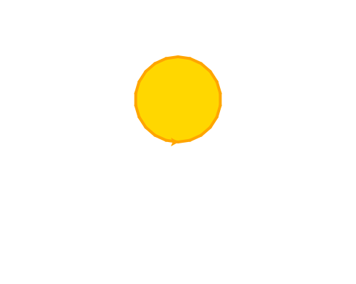

import CodeExercise from '@site/src/components/CodeExercise';

# Stap 1: Een zon (circle)

Een cirkel teken je met `turtle.circle()`. Het getal is de straal: de afstand
van het middelpunt tot de rand.

```python
import turtle

turtle.circle(50)
```

<CodeExercise>{`import turtle

turtle.circle(50)`}</CodeExercise>

De schildpad loopt een rondje naar links en komt terug waar hij begon. Let op
waar de cirkel ligt: niet om de schildpad heen, maar erboven. De schildpad
staat onderaan de rand, en het middelpunt ligt 50 boven hem.

## Opdracht: een zon

Teken een gele zon: een cirkel met een straal van 60, ingekleurd in
`"gold"`, met een oranje rand van 4 breed.



<CodeExercise>{`import turtle

turtle.circle(50)`}</CodeExercise>

<details>
<summary>Klik hier voor een tip.</summary>

Inkleuren gaat net als bij een vierkant: `fillcolor` en `begin_fill()` vóór
de cirkel, `end_fill()` erna. De rand kies je met `pencolor` en `pensize`.

</details>

<details>
<summary>Klik hier voor de oplossing.</summary>

{/* turtle-plaatje: img/stap-1-zon.svg */}

```python
import turtle

turtle.pencolor("orange")
turtle.pensize(4)
turtle.fillcolor("gold")
turtle.begin_fill()
turtle.circle(60)
turtle.end_fill()
```

</details>

## Er gaat iets mis

Je wilt een cirkel met het middelpunt op `(0, 0)`, en je schrijft:

```python
import turtle

turtle.circle(60)
```

De cirkel ligt boven het midden, niet eromheen.

**Oorzaak:** de schildpad staat op de rand van de cirkel, niet in het
midden. Het middelpunt ligt een straal links van waar hij kijkt: hier 60
boven hem.

**Oplossing:** loop eerst met de pen omhoog een straal omlaag, met
`turtle.goto(0, -60)`, en teken dan de cirkel.

Door naar [stap 2: een halve cirkel](./stap-2-boog).
