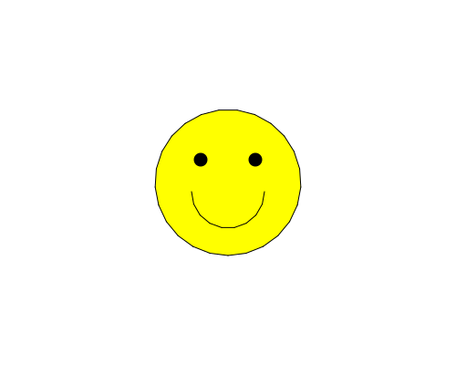

import CodeExercise from '@site/src/components/CodeExercise';

# Stap 2: Een smiley (setheading en een boog)

Met een tweede getal tekent `circle` maar een stuk van de cirkel. Bij 180
graden is dat een halve cirkel:

```python
import turtle

turtle.circle(50, 180)
```

Waar de boog heen buigt, hangt af van de kant waarop de schildpad kijkt.
Met `turtle.setheading()` zet je hem in één keer de goede kant op, zonder uit
te rekenen hoe ver hij moet draaien:

| `setheading` | De schildpad kijkt |
|:---:|:---:|
| 0 | naar rechts |
| 90 | omhoog |
| 180 | naar links |
| 270 | omlaag |

## Opdracht: een lachende mond

De startcode tekent een geel gezicht met twee ogen. Geef het een lachende
mond: een halve cirkel met een straal van 40, die begint op `(-40, -10)`
terwijl de schildpad omlaag kijkt.



<CodeExercise>{`import turtle

turtle.penup()
turtle.goto(0, -80)
turtle.pendown()
turtle.fillcolor("yellow")
turtle.begin_fill()
turtle.circle(80)
turtle.end_fill()

turtle.penup()
turtle.goto(-30, 25)
turtle.dot(15, "black")
turtle.goto(30, 25)
turtle.dot(15, "black")`}</CodeExercise>

<details>
<summary>Klik hier voor een tip.</summary>

Loop met de pen omhoog naar `(-40, -10)`. Laat de schildpad omlaag kijken
met `setheading(270)`, zet de pen neer, en teken `circle(40, 180)`. De boog
buigt naar de linkerkant van de schildpad. Kijkt hij omlaag, dan is dat
rechts: de boog gaat onder het midden door. Verberg de schildpad aan het
eind.

</details>

<details>
<summary>Klik hier voor de oplossing.</summary>

{/* turtle-plaatje: img/stap-2-smiley.svg */}

```python
import turtle

turtle.penup()
turtle.goto(0, -80)
turtle.pendown()
turtle.fillcolor("yellow")
turtle.begin_fill()
turtle.circle(80)
turtle.end_fill()

turtle.penup()
turtle.goto(-30, 25)
turtle.dot(15, "black")
turtle.goto(30, 25)
turtle.dot(15, "black")

turtle.goto(-40, -10)
turtle.setheading(270)
turtle.pendown()
turtle.circle(40, 180)
turtle.hideturtle()
```

Begin de mond eens op `(40, -40)` met `setheading(90)`. Omhoog kijkend ligt
de linkerkant van de schildpad naar links, dus de boog buigt over de
bovenkant: de smiley kijkt boos.

</details>

## Er gaat iets mis

Je vergeet `setheading(270)`. Na de ogen kijkt de schildpad nog naar rechts,
en de halve cirkel gaat omhoog, rond het linkeroog.

**Oorzaak:** `circle` met een positieve straal buigt altijd naar de
linkerkant van de schildpad. Kijkt hij naar rechts, dan is links omhoog.

**Oplossing:** zet de schildpad eerst de goede kant op met `setheading`,
en teken dan de boog.

Door naar het volgende project: [Een robotkop](/docs/projecten/turtle/robotkop/stap-1-maat).
