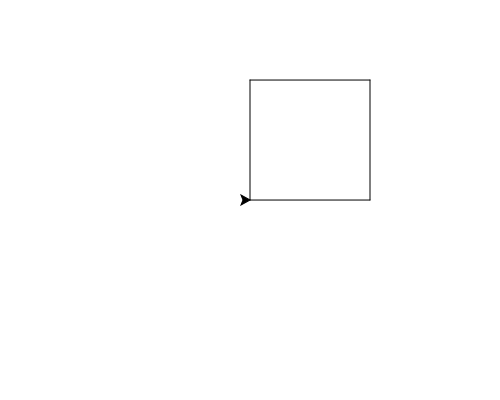

import CodeExercise from '@site/src/components/CodeExercise';

# Stap 1: Naar een punt (goto)

Tot nu toe liep de schildpad vooruit en draaide hij. Je kunt hem ook in één
keer naar een punt sturen. Elk punt heeft twee getallen: hoe ver naar rechts
(de **x**) en hoe ver omhoog (de **y**). De schildpad begint in het midden,
op `(0, 0)`.

```python
import turtle

turtle.goto(100, 0)
turtle.goto(50, 80)
turtle.goto(0, 0)
```

<CodeExercise>{`import turtle

turtle.goto(100, 0)
turtle.goto(50, 80)
turtle.goto(0, 0)`}</CodeExercise>

`turtle.goto(100, 0)` loopt naar 100 rechts van het midden, op dezelfde
hoogte. `goto(50, 80)` loopt schuin omhoog naar de top, en `goto(0, 0)` terug
naar het begin. Je hoeft niet uit te rekenen hoe ver en hoe schuin: de
schildpad loopt in een rechte lijn naar het punt. Onderweg tekent hij, net als
bij `forward`.

Een getal links van het midden is negatief: `(-100, 0)` ligt 100 naar links.
Hetzelfde geldt voor onder het midden.

## Opdracht: de rand van een dobbelsteen

Teken met vier keer `goto` een vierkant van 120, met de linkerhoek onderaan
op `(0, 0)`.



<CodeExercise>{`import turtle

turtle.goto(120, 0)`}</CodeExercise>

<details>
<summary>Klik hier voor een tip.</summary>

De vier hoeken zijn `(0, 0)`, `(120, 0)`, `(120, 120)` en `(0, 120)`. Loop
ze na elkaar af, en eindig weer op `(0, 0)`.

</details>

<details>
<summary>Klik hier voor de oplossing.</summary>

{/* turtle-plaatje: img/stap-1-rand.svg */}

```python
import turtle

turtle.goto(120, 0)
turtle.goto(120, 120)
turtle.goto(0, 120)
turtle.goto(0, 0)
```

</details>

## Er gaat iets mis

{/* niet-compileren: bewuste syntaxfout, de komma ontbreekt */}

```python
import turtle

turtle.goto(120 0)
```

{/* foutmelding-van: import turtle\nturtle.goto(120 0) */}

```
SyntaxError: invalid syntax. Perhaps you forgot a comma?
```

**Oorzaak:** tussen de x en de y hoort een komma. Zonder komma ziet Python
twee getallen naast elkaar staan, en weet hij niet wat je bedoelt.

**Oplossing:** zet de komma ertussen: `turtle.goto(120, 0)`. Python raadt het
zelf al: `Perhaps you forgot a comma?`.

Door naar [stap 2: de stippen](./stap-2-stippen).
