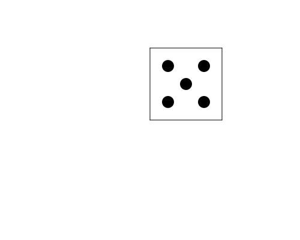

import CodeExercise from '@site/src/components/CodeExercise';

# Stap 2: De stippen (dot)

:::info
Deze stap gebruikt `penup`, uit [Een huis](/docs/projecten/turtle/een-huis/stap-2-raam).
:::

Een stip zet je met `turtle.dot()`, op de plek waar de schildpad staat. Het
eerste getal is hoe breed de stip is, daarna komt de kleur:

```python
import turtle

turtle.penup()
turtle.goto(60, 60)
turtle.dot(20, "black")
turtle.hideturtle()
```

<CodeExercise>{`import turtle

turtle.penup()
turtle.goto(60, 60)
turtle.dot(20, "black")
turtle.hideturtle()`}</CodeExercise>

- De pen gaat eerst omhoog, zodat `goto` geen lijn trekt naar de stip. Een
  stip zet de schildpad ook met de pen omhoog.
- `turtle.hideturtle()` verbergt de schildpad. Anders staat de pijl midden op
  je stip.

## Opdracht: de vijf van een dobbelsteen

Teken de rand uit stap 1, en zet er vijf zwarte stippen van 20 in: één in
het midden en één bij elke hoek.



<CodeExercise>{`import turtle

turtle.goto(120, 0)
turtle.goto(120, 120)
turtle.goto(0, 120)
turtle.goto(0, 0)`}</CodeExercise>

<details>
<summary>Klik hier voor een tip.</summary>

Het midden is `(60, 60)`. De stippen bij de hoeken staan 30 van de rand:
`(30, 30)`, `(90, 30)`, `(30, 90)` en `(90, 90)`. Til de pen op na de
rand, en verberg de schildpad aan het eind.

</details>

<details>
<summary>Klik hier voor de oplossing.</summary>

{/* turtle-plaatje: img/stap-2-vijf.svg */}

```python
import turtle

turtle.goto(120, 0)
turtle.goto(120, 120)
turtle.goto(0, 120)
turtle.goto(0, 0)

turtle.penup()
turtle.goto(30, 30)
turtle.dot(20, "black")
turtle.goto(90, 30)
turtle.dot(20, "black")
turtle.goto(60, 60)
turtle.dot(20, "black")
turtle.goto(30, 90)
turtle.dot(20, "black")
turtle.goto(90, 90)
turtle.dot(20, "black")
turtle.hideturtle()
```

</details>

## Er gaat iets mis

Je vergeet `turtle.penup()` na de rand. Dan loopt er een zwarte lijn van de
hoek van de dobbelsteen naar de eerste stip, en van elke stip naar de
volgende.

**Oorzaak:** `goto` tekent net als `forward`, zolang de pen omlaag staat.

**Oplossing:** zet `turtle.penup()` vóór de eerste `goto` naar een stip.

Door naar het volgende project: [Cirkels en bogen](/docs/projecten/turtle/cirkels/stap-1-cirkel).
