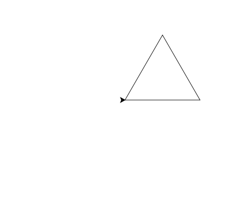

import CodeExercise from '@site/src/components/CodeExercise';

# Stap 1: Een driehoek (de draaihoek)

Bij een vierkant draait de schildpad na elke zijde 90 graden. Bij een
driehoek met drie gelijke zijden is dat 120 graden:

```python
import turtle

turtle.forward(100)
turtle.left(120)
turtle.forward(100)
turtle.left(120)
turtle.forward(100)
turtle.left(120)
```

Waarom 120 en niet 60? Binnenin is elke hoek van deze driehoek 60 graden.
Maar de schildpad draait om de buitenkant van de hoek: hij kijkt eerst
rechtdoor, en moet dan zo ver terugdraaien dat hij langs de volgende zijde
kijkt. Dat is 180 min 60, dus 120.

Na drie hoeken van 120 graden heeft de schildpad samen 360 graden gedraaid:
precies één keer rond. Bij het vierkant was dat vier keer 90, ook 360.

## Opdracht: een grote driehoek

Teken een driehoek met drie zijden van 150.



<CodeExercise>{`import turtle

turtle.forward(100)
turtle.left(120)`}</CodeExercise>

<details>
<summary>Klik hier voor een tip.</summary>

Drie zijden, en na elke zijde `left(120)`. Alleen de lengte verandert.

</details>

<details>
<summary>Klik hier voor de oplossing.</summary>

{/* turtle-plaatje: img/stap-1-driehoek.svg */}

```python
import turtle

turtle.forward(150)
turtle.left(120)
turtle.forward(150)
turtle.left(120)
turtle.forward(150)
turtle.left(120)
```

</details>

## Er gaat iets mis

```python
import turtle

turtle.forward(100)
turtle.left(60)
turtle.forward(100)
turtle.left(60)
turtle.forward(100)
turtle.left(60)
```

Je krijgt geen driehoek, maar een halve zeshoek die niet dichtgaat.

**Oorzaak:** 60 graden is de hoek binnenin. De schildpad draait maar een
klein stukje, en drie keer 60 is 180: een halve draai, geen hele.

**Oplossing:** draai 120 graden. Controleer het met optellen: bij een
gesloten vorm draait de schildpad samen 360 graden.

Door naar [stap 2: een ruit](./stap-2-ruit).
