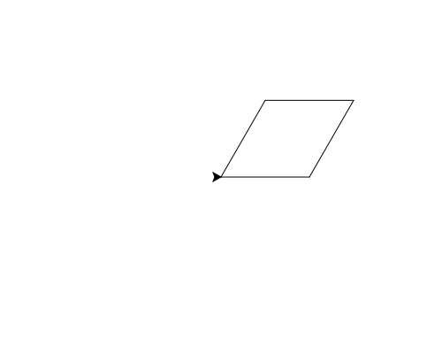

import CodeExercise from '@site/src/components/CodeExercise';

# Stap 2: Een ruit (twee soorten hoeken)

Een ruit heeft vier even lange zijden, net als een vierkant. Maar de hoeken
zijn niet allemaal even groot: twee zijn scherp, twee zijn stomp. Daarom
draait de schildpad om en om een klein en een groot stuk.

## Opdracht: een ruit

Teken een ruit met zijden van 100. Draai om en om 60 en 120 graden naar
links.



<CodeExercise>{`import turtle

turtle.forward(100)
turtle.left(60)`}</CodeExercise>

<details>
<summary>Klik hier voor een tip.</summary>

Vier keer `forward(100)`, en ertussen `left(60)`, `left(120)`, `left(60)`
en `left(120)`. Tel na: samen is dat 360.

</details>

<details>
<summary>Klik hier voor de oplossing.</summary>

{/* turtle-plaatje: img/stap-2-ruit.svg */}

```python
import turtle

turtle.forward(100)
turtle.left(60)
turtle.forward(100)
turtle.left(120)
turtle.forward(100)
turtle.left(60)
turtle.forward(100)
turtle.left(120)
```

Na de laatste hoek kijkt de schildpad weer naar rechts: 60 + 120 + 60 + 120
is 360.

</details>

Door naar het volgende project: [Kleur en dikte](/docs/projecten/turtle/kleuren/stap-1-pen).
