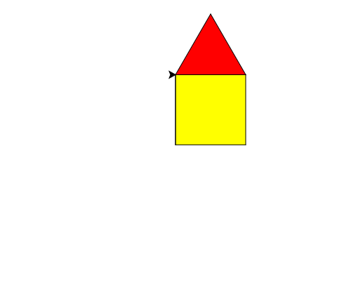

import CodeExercise from '@site/src/components/CodeExercise';

# Stap 1: Een huis (vormen combineren)

:::info
Deze stap gebruikt het vierkant, de driehoek en inkleuren uit [Een vierkant](/docs/projecten/turtle/vierkant/stap-1-vierkant), [Een driehoek](/docs/projecten/turtle/driehoek/stap-1-driehoek) en [Kleur en dikte](/docs/projecten/turtle/kleuren/stap-2-vullen).
:::

Een vierkant met een driehoek erop is een huis. Beide vormen ken je al. Het
enige nieuwe is de weg ertussen.

## Van muur naar dak

Na het vierkant staat de schildpad weer linksonder en kijkt hij naar rechts.
Het dak begint linksboven. Daar komt hij zo:

```python
import turtle

turtle.left(90)
turtle.forward(100)
turtle.right(90)
```

Hij loopt langs de linkermuur omhoog, en draait terug naar rechts. Omdat die
lijn al getekend is, zie je er niets extra van.

## Opdracht: een huis

Teken een huis met gele muren van 100 en een rood dak. Zet onder de muren de
drie regels van hierboven, en daaronder de driehoek met zijn eigen
`fillcolor`, `begin_fill` en `end_fill`.



<CodeExercise>{`import turtle

turtle.fillcolor("yellow")
turtle.begin_fill()
turtle.forward(100)
turtle.left(90)
turtle.forward(100)
turtle.left(90)
turtle.forward(100)
turtle.left(90)
turtle.forward(100)
turtle.left(90)
turtle.end_fill()`}</CodeExercise>

<details>
<summary>Klik hier voor een tip.</summary>

Eerst de muren (die staan er al), dan de drie regels naar linksboven, dan
`fillcolor("red")` en `begin_fill()`, de driehoek, en `end_fill()`.

</details>

<details>
<summary>Klik hier voor de oplossing.</summary>

{/* turtle-plaatje: img/stap-1-huis.svg */}

```python
import turtle

turtle.fillcolor("yellow")
turtle.begin_fill()
turtle.forward(100)
turtle.left(90)
turtle.forward(100)
turtle.left(90)
turtle.forward(100)
turtle.left(90)
turtle.forward(100)
turtle.left(90)
turtle.end_fill()

turtle.left(90)
turtle.forward(100)
turtle.right(90)

turtle.fillcolor("red")
turtle.begin_fill()
turtle.forward(100)
turtle.left(120)
turtle.forward(100)
turtle.left(120)
turtle.forward(100)
turtle.left(120)
turtle.end_fill()
```

</details>

## Er gaat iets mis

Je vergeet de drie regels tussen de muren en het dak. Dan staat het rode dak
niet op het huis, maar in de muren: de driehoek begint linksonder, en valt
helemaal binnen het gele vierkant.

**Oorzaak:** het dak begint waar de schildpad staat. Na de muren is dat
linksonder, niet linksboven.

**Oplossing:** loop eerst naar de plek waar de volgende vorm begint. Twijfel
je waar de schildpad staat, druk dan op Stap voor stap.

Door naar [stap 2: een raam](./stap-2-raam).
