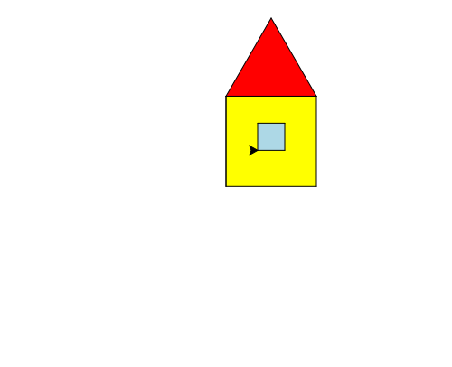

import CodeExercise from '@site/src/components/CodeExercise';

# Stap 2: Een raam (penup en pendown)

Het huis krijgt een raam, midden in de gele muur. Daarvoor moet de schildpad
door de muur heen lopen naar de plek van het raam. Met de pen omlaag trekt
hij dan een streep dwars door het geel. Dat voorkom je met twee nieuwe
commando's:

```python
import turtle

turtle.forward(50)
turtle.penup()
turtle.forward(30)
turtle.pendown()
turtle.forward(50)
```

<CodeExercise>{`import turtle

turtle.forward(50)
turtle.penup()
turtle.forward(30)
turtle.pendown()
turtle.forward(50)`}</CodeExercise>

- `turtle.penup()` tilt de pen op: de schildpad loopt, maar tekent niet.
- `turtle.pendown()` zet de pen weer neer: vanaf nu tekent hij weer.

Je ziet twee lijnen met een gat ertussen.

## Opdracht: een raam

De startcode is het huis uit stap 1. Na het dak staat de schildpad linksboven
en kijkt hij naar rechts. Loop met de pen omhoog naar het punt 35 naar rechts
en 40 omhoog vanaf de linkerhoek onderaan. Teken daar een lichtblauw vierkant
van 30 als raam.



<CodeExercise>{`import turtle

turtle.fillcolor("yellow")
turtle.begin_fill()
turtle.forward(100)
turtle.left(90)
turtle.forward(100)
turtle.left(90)
turtle.forward(100)
turtle.left(90)
turtle.forward(100)
turtle.left(90)
turtle.end_fill()

turtle.left(90)
turtle.forward(100)
turtle.right(90)

turtle.fillcolor("red")
turtle.begin_fill()
turtle.forward(100)
turtle.left(120)
turtle.forward(100)
turtle.left(120)
turtle.forward(100)
turtle.left(120)
turtle.end_fill()`}</CodeExercise>

<details>
<summary>Klik hier voor een tip.</summary>

Pen omhoog. Draai naar beneden met `right(90)` en loop 60 omlaag: dan sta je
op 40 hoog. Draai terug naar rechts met `left(90)` en loop 35. Pen omlaag, en
teken het vierkant met `fillcolor("lightblue")`.

</details>

<details>
<summary>Klik hier voor de oplossing.</summary>

{/* turtle-plaatje: img/stap-2-raam.svg */}

```python
import turtle

turtle.fillcolor("yellow")
turtle.begin_fill()
turtle.forward(100)
turtle.left(90)
turtle.forward(100)
turtle.left(90)
turtle.forward(100)
turtle.left(90)
turtle.forward(100)
turtle.left(90)
turtle.end_fill()

turtle.left(90)
turtle.forward(100)
turtle.right(90)

turtle.fillcolor("red")
turtle.begin_fill()
turtle.forward(100)
turtle.left(120)
turtle.forward(100)
turtle.left(120)
turtle.forward(100)
turtle.left(120)
turtle.end_fill()

turtle.penup()
turtle.right(90)
turtle.forward(60)
turtle.left(90)
turtle.forward(35)
turtle.pendown()

turtle.fillcolor("lightblue")
turtle.begin_fill()
turtle.forward(30)
turtle.left(90)
turtle.forward(30)
turtle.left(90)
turtle.forward(30)
turtle.left(90)
turtle.forward(30)
turtle.left(90)
turtle.end_fill()
```

</details>

## Er gaat iets mis

Je vergeet `turtle.penup()`. Dan zie je een zwarte streep door de gele muur,
van de linkermuur naar de linkeronderhoek van het raam.

**Oorzaak:** zolang de pen omlaag staat, tekent de schildpad bij elke stap.
Het stuk langs de linkermuur zie je niet, want daar stond al een lijn. Het
stuk door het geel wel.

**Oplossing:** til de pen op voordat je naar een nieuwe plek loopt, en zet
hem pas neer als je weer wilt tekenen.

Door naar het volgende project: [Een dobbelsteen](/docs/projecten/turtle/dobbelsteen/stap-1-goto).
