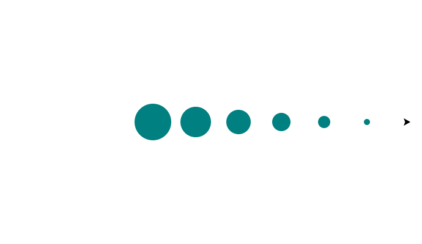

import CodeExercise from '@site/src/components/CodeExercise';

# Stap 1: Steeds groter (de loopvariabele)

:::info
Deze stap gebruikt de for-loop, uit [De for-loop](/docs/herhalen/06a-for-loop), en rekenen, uit [Rekenmachine](/docs/basis/rekenmachine).
:::

In [Veelhoeken en sterren](/docs/projecten/turtle/veelhoeken/stap-1-vierkant)
deed de loop elke ronde precies hetzelfde. De variabele achter `for` telt
ondertussen mee: 0, 1, 2, en zo verder. Die kun je zelf gebruiken:

```python
import turtle

turtle.penup()
for i in range(5):
    turtle.dot(10 + i * 10, "orange")
    turtle.forward(60)
```

<CodeExercise>{`import turtle

turtle.penup()
for i in range(5):
    turtle.dot(10 + i * 10, "orange")
    turtle.forward(60)`}</CodeExercise>

| Ronde | `i` | `10 + i * 10` |
|:---:|:---:|:---:|
| 1 | 0 | 10 |
| 2 | 1 | 20 |
| 3 | 2 | 30 |
| 4 | 3 | 40 |
| 5 | 4 | 50 |

Elke ronde is `i` één groter, dus elke stip is 10 breder dan de vorige. Met
Stap voor stap zie je `i` per ronde veranderen.

## Opdracht: van groot naar klein

Teken zes stippen in `"teal"`, 70 uit elkaar. De eerste is 60 breed, en elke
volgende is 10 kleiner.



<CodeExercise>{`import turtle

turtle.penup()
for i in range(5):
    turtle.dot(10 + i * 10, "orange")
    turtle.forward(60)`}</CodeExercise>

<details>
<summary>Klik hier voor een tip.</summary>

In de eerste ronde is `i` 0, en moet de stip 60 zijn. Elke ronde gaat er 10
af, dus je trekt `i * 10` af van 60.

</details>

<details>
<summary>Klik hier voor de oplossing.</summary>

{/* turtle-plaatje: img/stap-1-krimpen.svg */}

```python
import turtle

turtle.penup()
for i in range(6):
    turtle.dot(60 - i * 10, "teal")
    turtle.forward(70)
```

De laatste stip, bij `i` gelijk aan 5, is 60 min 50: 10 breed.

</details>

## Er gaat iets mis

```python
import turtle

turtle.penup()
for i in range(5):
    turtle.dot(i * 10, "orange")
    turtle.forward(60)
```

Je ziet maar vier stippen, en links een leeg stuk.

**Oorzaak:** `i` begint bij 0, niet bij 1. De eerste stip is dus 0 breed, en
die zie je niet.

**Oplossing:** tel er iets bij op, zoals `10 + i * 10`, of laat de loop
bij een ander getal beginnen. Hoe dat laatste gaat, zie je in stap 2.

Door naar [stap 2: range met stappen](./stap-2-range).
