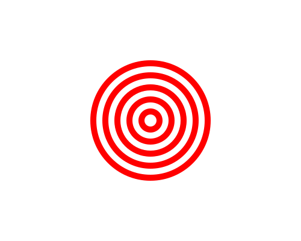

import CodeExercise from '@site/src/components/CodeExercise';

# Stap 2: Een schietschijf (range met stappen)

:::info
Deze stap gebruikt `range` met een begin, een eind en een stap, uit [Range met stappen](/docs/herhalen/06b-range-stappen).
:::

In stap 1 rekende je de maat uit met `10 + i * 10`. `range` kan die maten ook
zelf tellen. Met drie getallen geef je het begin, het eind en de stap:

```python
import turtle

turtle.penup()
for grootte in range(10, 60, 10):
    turtle.dot(grootte, "orange")
    turtle.forward(60)
```

Dit tekent dezelfde vijf stippen als in stap 1: `grootte` is 10, 20, 30, 40
en 50. De 60 doet zelf niet mee: `range` stopt ervoor.

Met een negatieve stap telt `range` achteruit. `range(200, 0, -40)` geeft
200, 160, 120, 80 en 40.

## Opdracht: een schietschijf

Teken een schietschijf: rode en witte ringen om elkaar heen. Zet op dezelfde
plek eerst een rode stip van 200, dan een witte van 180, een rode van 160, en
zo verder tot een witte van 20.



<CodeExercise>{`import turtle

for grootte in range(200, 0, -40):
    turtle.dot(grootte, "red")`}</CodeExercise>

<details>
<summary>Klik hier voor een tip.</summary>

De loop geeft 200, 160, 120, 80 en 40: de rode stippen. Zet in de loop onder
de rode stip een witte die 20 kleiner is. Verberg de schildpad aan het eind.

</details>

<details>
<summary>Klik hier voor de oplossing.</summary>

{/* turtle-plaatje: img/stap-2-schietschijf.svg */}

```python
import turtle

for grootte in range(200, 0, -40):
    turtle.dot(grootte, "red")
    turtle.dot(grootte - 20, "white")
turtle.hideturtle()
```

Elke stip komt over de vorige heen. Omdat ze steeds kleiner worden, blijft er
van elke stip een ring over.

</details>

## Er gaat iets mis

```python
import turtle

turtle.penup()
for grootte in range(10, 50, 10):
    turtle.dot(grootte, "orange")
    turtle.forward(60)
```

Je wilde vijf stippen tot en met 50, maar je krijgt er vier: de grootste is
40.

**Oorzaak:** het tweede getal van `range` doet zelf niet mee. `range` stopt
net ervoor.

**Oplossing:** kies een eind dat één stap verder ligt: `range(10, 60, 10)`.

Door naar het volgende project: [Een spiraal](/docs/projecten/turtle/spiraal/stap-1-spiraal).
