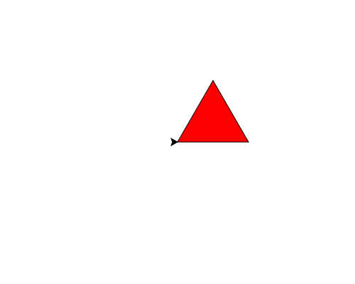

import CodeExercise from '@site/src/components/CodeExercise';

# Stap 2: Inkleuren (fillcolor)

Een vorm inkleuren gaat in drie stappen. Met `turtle.fillcolor()` kies je de
vulkleur. Alles wat de schildpad daarna tekent tussen `turtle.begin_fill()` en
`turtle.end_fill()`, kleurt hij in:

```python
import turtle

turtle.fillcolor("yellow")
turtle.begin_fill()
turtle.forward(100)
turtle.left(90)
turtle.forward(100)
turtle.left(90)
turtle.forward(100)
turtle.left(90)
turtle.forward(100)
turtle.left(90)
turtle.end_fill()
```

<CodeExercise>{`import turtle

turtle.fillcolor("yellow")
turtle.begin_fill()
turtle.forward(100)
turtle.left(90)
turtle.forward(100)
turtle.left(90)
turtle.forward(100)
turtle.left(90)
turtle.forward(100)
turtle.left(90)
turtle.end_fill()`}</CodeExercise>

De lijn eromheen blijft zwart: die kleur kies je met `pencolor`, uit stap 1.

## Opdracht: een rode driehoek

Teken de driehoek uit [Een driehoek](/docs/projecten/turtle/driehoek/stap-1-driehoek)
met zijden van 100, ingekleurd in rood.



<CodeExercise>{`import turtle

turtle.forward(100)
turtle.left(120)
turtle.forward(100)
turtle.left(120)
turtle.forward(100)
turtle.left(120)`}</CodeExercise>

<details>
<summary>Klik hier voor een tip.</summary>

`fillcolor("red")` en `begin_fill()` komen boven de eerste `forward`,
`end_fill()` onder de laatste `left`.

</details>

<details>
<summary>Klik hier voor de oplossing.</summary>

{/* turtle-plaatje: img/stap-2-rood.svg */}

```python
import turtle

turtle.fillcolor("red")
turtle.begin_fill()
turtle.forward(100)
turtle.left(120)
turtle.forward(100)
turtle.left(120)
turtle.forward(100)
turtle.left(120)
turtle.end_fill()
```

</details>

## Er gaat iets mis

```python
import turtle

turtle.fillcolor("yellow")
turtle.begin_fill()
turtle.forward(100)
turtle.left(90)
turtle.forward(100)
turtle.left(90)
turtle.forward(100)
turtle.left(90)
turtle.forward(100)
```

Het vierkant blijft wit.

**Oorzaak:** `turtle.end_fill()` ontbreekt. De schildpad kleurt pas in als
hij weet dat de vorm af is, en dat zeg je met `end_fill()`.

**Oplossing:** zet na de laatste lijn van de vorm `turtle.end_fill()`.

Door naar het volgende project: [Een huis](/docs/projecten/turtle/een-huis/stap-1-huis).
