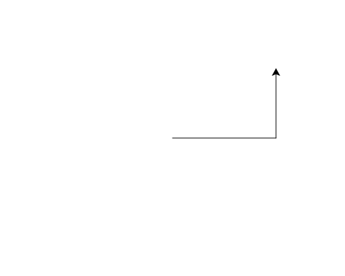

import CodeExercise from '@site/src/components/CodeExercise';

# Stap 1: Een schildpad die tekent (forward en left)

Met **turtle** laat je een schildpad met een pen over het scherm lopen. Waar
hij langskomt, trekt hij een lijn. Jij geeft de commando's, één voor één,
van boven naar beneden.

```python
import turtle

turtle.forward(100)
turtle.left(90)
turtle.forward(50)
```

Druk op Uitvoeren en kijk wat er gebeurt.

<CodeExercise>{`import turtle

turtle.forward(100)
turtle.left(90)
turtle.forward(50)`}</CodeExercise>

- `import turtle` zet de turtle-commando's klaar. Hoe dat precies werkt, lees
  je later in [Modules](/docs/modules/09d-modules).
- `turtle.forward(100)` loopt 100 stappen vooruit, in de richting waarin de
  schildpad kijkt. Aan het begin is dat naar rechts.
- `turtle.left(90)` draait 90 graden naar links, op de plek waar hij staat.
  Draaien tekent niets.

De pijl aan het eind van de lijn is de schildpad. Na `left(90)` kijkt hij
omhoog, dus de tweede lijn gaat naar boven.

## Opdracht: een hoek

Teken een lijn van 150 naar rechts, en daarna een lijn van 100 omhoog.



<CodeExercise>{`import turtle

turtle.forward(100)
turtle.left(90)
turtle.forward(50)`}</CodeExercise>

<details>
<summary>Klik hier voor een tip.</summary>

Je hebt dezelfde drie commando's nodig als hierboven. Alleen de getallen in
de twee `forward`-regels veranderen.

</details>

<details>
<summary>Klik hier voor de oplossing.</summary>

{/* turtle-plaatje: img/stap-1-hoek.svg */}

```python
import turtle

turtle.forward(150)
turtle.left(90)
turtle.forward(100)
```

</details>

## Er gaat iets mis

{/* foutmelding-van: blok-erboven */}

```python
import turtle

turtle.Forward(100)
```

```
AttributeError: module 'turtle' has no attribute 'Forward'. Did you mean: 'forward'?
```

**Oorzaak:** Python ziet het verschil tussen hoofdletters en kleine letters.
`Forward` is een ander woord dan `forward`, en dat kent turtle niet.

**Oplossing:** schrijf de commando's met kleine letters, zoals
`turtle.forward(100)`. Python raadt het zelf al: `Did you mean: 'forward'?`.

Door naar [stap 2: naar rechts draaien](./stap-2-right).
