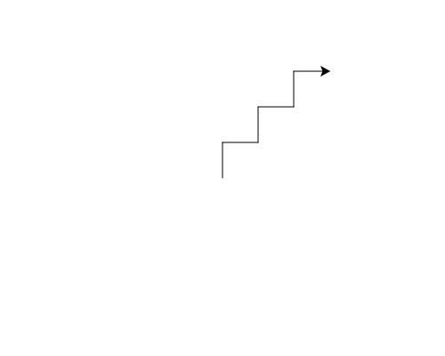

import CodeExercise from '@site/src/components/CodeExercise';

# Stap 2: Een trap (right)

Naast `left` is er `right`: die draait de schildpad naar rechts. Wissel je ze
af, dan loopt de schildpad zigzag omhoog:

```python
import turtle

turtle.left(90)
turtle.forward(40)
turtle.right(90)
turtle.forward(40)
```

Eerst draait hij van rechts naar boven, en loopt hij 40 omhoog. Dan draait
hij terug naar rechts, en loopt hij 40 naar rechts. Dat is één trede.

## Opdracht: drie treden

Teken een trap met drie treden van 40 hoog en 40 breed.



<CodeExercise>{`import turtle

turtle.left(90)
turtle.forward(40)
turtle.right(90)
turtle.forward(40)`}</CodeExercise>

<details>
<summary>Klik hier voor een tip.</summary>

Een trede is vier regels. Na een trede kijkt de schildpad weer naar rechts,
net als aan het begin. Zet de vier regels dus nog twee keer onder elkaar.

</details>

<details>
<summary>Klik hier voor de oplossing.</summary>

{/* turtle-plaatje: img/stap-2-trap.svg */}

```python
import turtle

turtle.left(90)
turtle.forward(40)
turtle.right(90)
turtle.forward(40)

turtle.left(90)
turtle.forward(40)
turtle.right(90)
turtle.forward(40)

turtle.left(90)
turtle.forward(40)
turtle.right(90)
turtle.forward(40)
```

Drie keer dezelfde vier regels. In
[Veelhoeken en sterren](/docs/projecten/turtle/veelhoeken/stap-1-vierkant)
leer je hoe een loop dat herhalen voor je doet.

</details>

## Er gaat iets mis

```python
import turtle

turtle.left(90)
turtle.forward(40)
turtle.left(90)
turtle.forward(40)
```

Je verwacht een trede, maar de tweede lijn gaat naar links.

**Oorzaak:** twee keer `left(90)` draait de schildpad eerst omhoog, en dan
nog een kwartslag verder: naar links.

**Oplossing:** draai terug met `right(90)`. Twijfel je welke kant de
schildpad op kijkt, druk dan op Stap voor stap: de pijl laat het zien.

Door naar het volgende project: [Een vierkant](/docs/projecten/turtle/vierkant/stap-1-vierkant).
