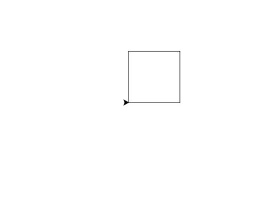

import CodeExercise from '@site/src/components/CodeExercise';

# Stap 1: Een vierkant (commando's na elkaar)

:::info
Deze stap gebruikt `forward` en `left`, uit [Lijnen en hoeken](/docs/projecten/turtle/lijnen/stap-1-forward).
:::

Een vierkant heeft vier even lange zijden, en na elke zijde een hoek van 90
graden. Twee zijden heb je al:

```python
import turtle

turtle.forward(100)
turtle.left(90)
turtle.forward(100)
```

## Opdracht: een vierkant

Maak er een vierkant van met zijden van 100.



<CodeExercise>{`import turtle

turtle.forward(100)
turtle.left(90)
turtle.forward(100)`}</CodeExercise>

<details>
<summary>Klik hier voor een tip.</summary>

Elke zijde is een `forward(100)` en elke hoek een `left(90)`. Tel hoeveel
zijden en hoeken een vierkant heeft.

</details>

<details>
<summary>Klik hier voor de oplossing.</summary>

{/* turtle-plaatje: img/stap-1-vierkant.svg */}

```python
import turtle

turtle.forward(100)
turtle.left(90)
turtle.forward(100)
turtle.left(90)
turtle.forward(100)
turtle.left(90)
turtle.forward(100)
turtle.left(90)
```

De laatste `left(90)` hoeft niet voor het vierkant. Maar zo kijkt de
schildpad weer naar rechts, net als aan het begin. Straks bouw je vormen op
elkaar, en dan is het handig dat elke vorm op dezelfde manier eindigt.

</details>

## Er gaat iets mis

```python
import turtle

turtle.forward(100)
turtle.left(90)
turtle.forward(100)
turtle.forward(100)
turtle.left(90)
turtle.forward(100)
```

Je verwacht een vierkant, maar de rechterkant wordt 200 lang, de bovenkant
zit op 200 hoog, en de linkerkant ontbreekt. De vorm blijft open.

**Oorzaak:** tussen de tweede en de derde `forward` ontbreekt een
`left(90)`. Zonder draai loopt de schildpad rechtdoor.

**Oplossing:** zet na elke zijde een draai. Tel je regels: een vierkant is
vier keer `forward` en vier keer `left`, om en om.

Door naar [stap 2: een rechthoek](./stap-2-rechthoek).
