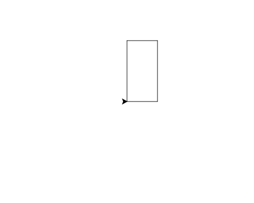

import CodeExercise from '@site/src/components/CodeExercise';

# Stap 2: Een rechthoek (commando's na elkaar)

Een rechthoek lijkt op een vierkant: vier zijden en vier hoeken van 90
graden. Alleen zijn de zijden niet allemaal even lang. De onderkant en de
bovenkant zijn even lang, en de linkerkant en de rechterkant ook.

## Opdracht: een deur

Teken een rechthoek van 60 breed en 120 hoog: een deur.



<CodeExercise>{`import turtle

turtle.forward(100)
turtle.left(90)
turtle.forward(100)
turtle.left(90)
turtle.forward(100)
turtle.left(90)
turtle.forward(100)
turtle.left(90)`}</CodeExercise>

<details>
<summary>Klik hier voor een tip.</summary>

De startcode is het vierkant uit stap 1. De schildpad loopt eerst naar
rechts (de breedte), dan omhoog (de hoogte), dan naar links (weer de
breedte) en dan omlaag (weer de hoogte).

</details>

<details>
<summary>Klik hier voor de oplossing.</summary>

{/* turtle-plaatje: img/stap-2-deur.svg */}

```python
import turtle

turtle.forward(60)
turtle.left(90)
turtle.forward(120)
turtle.left(90)
turtle.forward(60)
turtle.left(90)
turtle.forward(120)
turtle.left(90)
```

</details>

Door naar het volgende project: [Een driehoek](/docs/projecten/turtle/driehoek/stap-1-driehoek).
