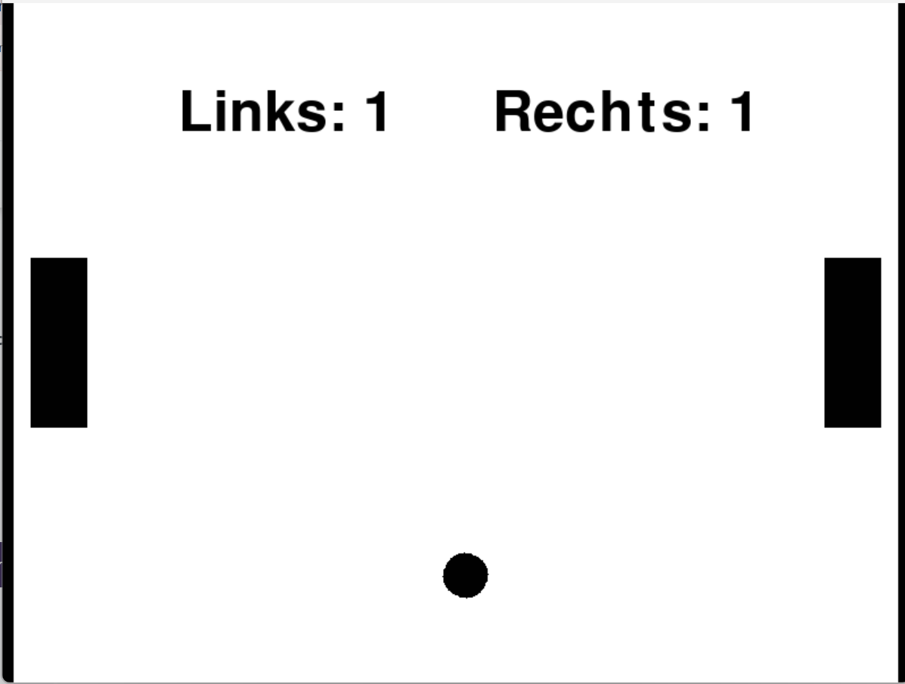

# Pong

Pong is een klassieker en een perfect project om met `coderius-play` te bouwen!
Laten we eens bekijken wat je hiervoor nodig hebt. Bij elke stap geven we hints, maar je moet zelf de code schrijven.

Voor voorbeelden ga je uiteraard naar de [Cheatsheet](/docs/cheatsheet).

:::tip
In [opdracht 2.2.a](/docs/fysica/physics_info#opdracht-22a-welk-type-gebruik-je) heb je al nagedacht over welk type fysica je voor elk onderdeel van pong zou gebruiken. Dat komt hier goed van pas!
:::

## Stap 1: De bal

De bal beweegt vrij rond en stuitert tegen andere vormen. Dat is **dynamic** gedrag.

Maak een cirkel en geef deze fysica met een `x_speed`. Zorg dat de zwaartekracht uit staat.

Klik hier voor een tip!

Kijk naar `obeys_gravity` en `x_speed` bij `start_physics()` in de [Cheatsheet](/docs/cheatsheet).

## Stap 2: De batjes

Een batje wordt bestuurd door de speler, niet door de zwaartekracht. Dat is **kinematic** gedrag.

Maak twee rechthoeken: één links en één rechts op het scherm. Geef ze fysica zonder zwaartekracht en zonder snelheid.

Klik hier voor een tip!

Gebruik `x` om de batjes links en rechts te plaatsen, bijvoorbeeld `x=-350` en `x=350`.

## Stap 3: Batjes bewegen

Gebruik `@play.while_key_pressed` om de batjes omhoog en omlaag te laten bewegen. Hiermee beweegt het batje **elk frame** zolang je de toets inhoudt — precies wat je wilt bij Pong! Het linkerbatje kun je besturen met `w` en `s`, het rechterbatje met de pijltjestoetsen.

Klik hier voor een tip!

Je verandert de `y` van een batje om het omhoog of omlaag te bewegen. Kijk bij **Gebeurtenissen** in de [Cheatsheet](/docs/cheatsheet) voor een voorbeeld.

## Stap 4: Score bijhouden

Maak twee variabelen voor de score en twee tekstvariabelen om de score op het scherm te tonen.

Klik hier voor een tip!

Kijk bij **global** in de [Cheatsheet](/docs/cheatsheet) voor hoe je een score bijhoudt en bijwerkt.

## Stap 5: Scoren detecteren

Wanneer de bal de linkermuur raakt, scoort de rechterspeler een punt (en andersom). Gebruik `@bal.when_touching_wall` om dit te detecteren. Met `wall=play.WallSide.LEFT` of `wall=play.WallSide.RIGHT` geef je aan welke muur je bedoelt. `play.WallSide` is een voorgedefinieerde waarde met vier opties: `LEFT`, `RIGHT`, `TOP` en `BOTTOM`.

Na een punt moet je:
- De score van de juiste speler verhogen
- De scoretekst bijwerken
- De bal terug naar het midden zetten

Klik hier voor een tip!

Kijk bij **Gebeurtenis bij een vorm** in de [Cheatsheet](/docs/cheatsheet) voor een voorbeeld met `when_touching_wall`.

## Stap 6: De bal diagonaal laten bewegen

De bal beweegt nu alleen horizontaal. Gebruik naast `x_speed` ook `y_speed` om de bal diagonaal te laten bewegen!

## Mogelijke uitbreidingen
- Wanneer heeft iemand gewonnen?
- Kun je een batje door de computer laten besturen? (tip: kijk eens naar `distance_to` in de [Cheatsheet](/docs/cheatsheet))
- Hoe maak je een startmenu?
- Power-ups: een groter batje, een snellere bal, of een tijdelijke onzichtbare bal.
- Versnelling: verhoog de balsnelheid na elke keer dat een batje wordt geraakt.
- Speltimer: voeg een timer toe die aftelt tot het einde van het spel.
