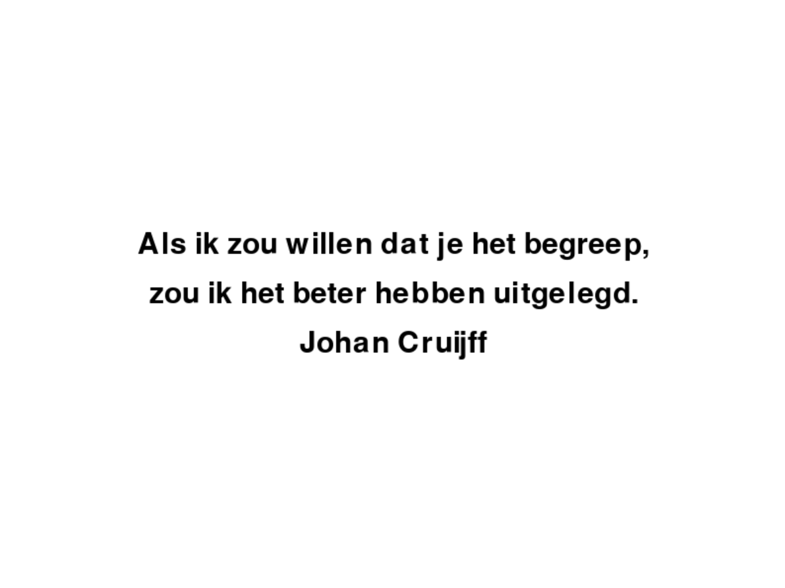

# 1.4 Je eerste tekst

:::info Wat moet je al weten
- [1.2 Je eerste cirkel](/docs/vormen/je_eerste_cirkel) - hoe je een vorm tekent en aanpast
:::

Tekeningen en spellen worden duidelijker met tekst. Met **coderius-play** kun je eenvoudig tekst toevoegen.
De werkwijze is vergelijkbaar met **play.new_circle** en **play.new_box**.

Voor **play.new_text** kun je de volgende attributen gebruiken:
- **words**: De tekst die op het scherm moet verschijnen.
- **x**: x-positie, staat standaard op 0 (het midden). Kleiner dan 0 is naar links, groter dan 0 is naar rechts.
- **y**: y-positie, staat standaard op 0 (het midden). Kleiner dan 0 is naar beneden, groter dan 0 is naar boven.
- **font**: het pad naar een lettertypebestand (bijvoorbeeld `'mijnfont.ttf'`). Sinds versie 3.3.3 kun je hier ook de naam van een systeemfont opgeven (bijvoorbeeld `'Arial'`) — dat werkt wanneer je het programma lokaal uitvoert. In de browser zijn systeemfonts niet beschikbaar; daar wordt automatisch het standaardfont gebruikt.
- **font_size**: de grootte van het lettertype.
- **color**: de kleur van de tekst.
- **transparency**: doorzichtigheid, 0 is onzichtbaar. 100 is volledig zichtbaar.
- **angle**: de hoek van de tekst in graden. Staat standaard op 0.
- **size**: de schaal van de tekst als percentage. Staat standaard op 100.

Hieronder zie je een voorbeeld:

<PygbagRunner code={`import play

play.new_text(words='hallo pythonista', font='default', font_size=30)`} height={300} />

### Opdracht 1.4.a Johan Cruijff

Maak onderstaande afbeelding na.



```python
import play

# PAS ONDERSTAANDE CODE AAN
play.new_text(words='Als ik zou willen dat je het begreep,')
```

<details>
    <summary>Klik hier voor een tip!</summary>

Het zijn drie **play.new_text** aanroepen.
De font_size is 40.

</details> 

<details>
    <summary>Klik hier voor een oplossing!</summary>

<PygbagRunner code={`import play

play.new_text(words='Als ik zou willen dat je het begreep,', y=100, font='default', font_size=40)
play.new_text(words='zou ik het beter hebben uitgelegd', y=0, font='default', font_size=40)
play.new_text(words='Johan Cruijff', y=-100, font='default', font_size=40)`} height={300} />

</details>
