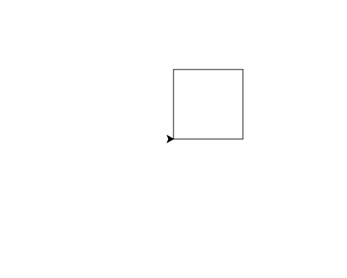

import CodeExercise from '@site/src/components/CodeExercise';

# Stap 1: Een schildpad die tekent (turtle-commando's)

In dit project teken je een straat vol huizen. Dat doe je met **turtle**: een
schildpad met een pen, die over het scherm loopt en een lijn trekt waar hij
langskomt. Jij geeft de commando's.

```python
import turtle

turtle.forward(100)
turtle.left(90)
turtle.forward(50)
```

Druk hieronder op Uitvoeren en kijk wat er gebeurt.

<CodeExercise>{`import turtle

turtle.forward(100)
turtle.left(90)
turtle.forward(50)`}</CodeExercise>

- `import turtle` zet de turtle-commando's klaar. Hoe dat precies werkt, lees
  je later in [Modules](/docs/functies/09d-modules).
- `turtle.forward(100)` loopt 100 stappen vooruit, in de richting waarin de
  schildpad kijkt. Aan het begin is dat naar rechts.
- `turtle.left(90)` draait 90 graden naar links, op de plek waar hij staat.
  Er is ook `turtle.right()`.

De pijl aan het eind van de lijn is de schildpad. Hij kijkt nu omhoog.

## Opdracht: een vierkant

Maak van de lijn en het stukje omhoog een vierkant met zijden van 100.



<CodeExercise>{`import turtle

turtle.forward(100)
turtle.left(90)
turtle.forward(100)`}</CodeExercise>

<details>
<summary>Klik hier voor een tip.</summary>

Elke zijde is een `forward(100)` en elke hoek een `left(90)`. Tel hoeveel
zijden en hoeken een vierkant heeft.

</details>

<details>
<summary>Klik hier voor de oplossing.</summary>

{/* turtle-plaatje: img/stap-1-vierkant.svg */}

```python
import turtle

turtle.forward(100)
turtle.left(90)
turtle.forward(100)
turtle.left(90)
turtle.forward(100)
turtle.left(90)
turtle.forward(100)
turtle.left(90)
```

De laatste `left(90)` hoeft niet voor het vierkant. Maar zo kijkt de
schildpad weer naar rechts, net als aan het begin. Dat heb je straks nodig.

</details>

## Er gaat iets mis

{/* foutmelding-van: blok-erboven */}

```python
import turtle

turtle.Forward(100)
```

```
AttributeError: module 'turtle' has no attribute 'Forward'. Did you mean: 'forward'?
```

**Oorzaak:** Python ziet het verschil tussen hoofdletters en kleine letters.
`Forward` is een ander woord dan `forward`, en dat kent turtle niet.

**Oplossing:** schrijf de commando's met kleine letters, zoals
`turtle.forward(100)`. Python raadt het zelf al: `Did you mean: 'forward'?`.

Door naar [stap 2: herhalen met een for-loop](./stap-2-for-loop).
