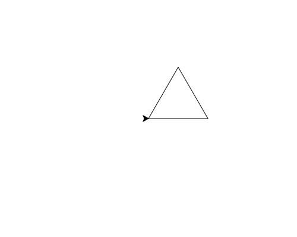

import CodeExercise from '@site/src/components/CodeExercise';

# Stap 2: Herhalen (for-loop)

:::info
Deze stap gebruikt de for-loop, uit [De for-loop](/docs/herhalen/06a-for-loop).
:::

Je vierkant uit stap 1 is vier keer hetzelfde: `forward(100)` en `left(90)`.
Een for-loop doet dat herhalen voor je.

```python
import turtle

for zijde in range(4):
    turtle.forward(100)
    turtle.left(90)
```

Dit tekent precies hetzelfde vierkant, in drie regels in plaats van acht.
Beide regels springen in, dus ze horen allebei bij de loop.

## Opdracht: een driehoek

Teken met een for-loop een driehoek met drie gelijke zijden van 100.



<CodeExercise>{`import turtle

for zijde in range(4):
    turtle.forward(100)
    turtle.left(90)`}</CodeExercise>

<details>
<summary>Klik hier voor een tip.</summary>

Een driehoek heeft drie zijden, dus de loop gaat drie keer rond. De hoek is
even puzzelen: na drie keer draaien kijkt de schildpad weer naar rechts, dus
samen draait hij 360 graden.

</details>

<details>
<summary>Klik hier voor de oplossing.</summary>

{/* turtle-plaatje: img/stap-2-driehoek.svg */}

```python
import turtle

for zijde in range(3):
    turtle.forward(100)
    turtle.left(120)
```

Drie keer 120 graden is 360. Dat de schildpad 120 graden draait en niet 60,
komt doordat hij de buitenkant van de hoek draait: binnenin is de hoek 60
graden, en 180 min 60 is 120.

</details>

## Er gaat iets mis

```python
import turtle

for zijde in range(4):
    turtle.forward(100)
turtle.left(90)
```

Je verwacht een vierkant, maar je krijgt één lange lijn van 400 stappen.

**Oorzaak:** `turtle.left(90)` springt niet in. Hij hoort dus niet bij de
loop: de schildpad loopt vier keer vooruit, en draait pas als de loop klaar
is.

**Oplossing:** laat alles wat herhaald moet worden, even ver inspringen onder
de `for`.

Door naar [stap 3: een huis met kleur](./stap-3-huis).
