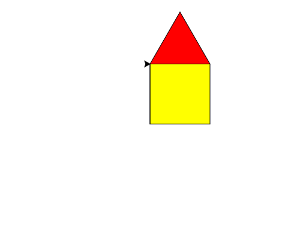

import CodeExercise from '@site/src/components/CodeExercise';

# Stap 3: Een huis in kleur (kleur en vullen)

:::info
Deze stap gebruikt de for-loop, uit [De for-loop](/docs/herhalen/06a-for-loop).
:::

Een vierkant met een driehoek erop is een huis. Eerst de kleur. Met
`turtle.fillcolor()` kies je een vulkleur. Alles wat de schildpad tekent
tussen `turtle.begin_fill()` en `turtle.end_fill()`, kleurt hij daarna in:

```python
import turtle

turtle.fillcolor("yellow")
turtle.begin_fill()
for zijde in range(4):
    turtle.forward(100)
    turtle.left(90)
turtle.end_fill()
```

De kleur is een Engels woord tussen aanhalingstekens, zoals `"red"`,
`"yellow"`, `"lightblue"` of `"brown"`. Met `turtle.pencolor()` kies je de
kleur van de lijn.

## Van muur naar dak

Na het vierkant staat de schildpad weer linksonder en kijkt hij naar rechts.
Het dak begint linksboven. Daar komt hij zo:

```python
import turtle

for zijde in range(4):
    turtle.forward(100)
    turtle.left(90)

turtle.left(90)
turtle.forward(100)
turtle.right(90)
```

Hij loopt over de linkermuur omhoog, en draait terug naar rechts. De lijn
die hij daarbij trekt, lag er al.

## Opdracht: een huis

Teken een huis met gele muren en een rood dak. De muren zijn het vierkant,
het dak is de driehoek uit stap 2, getekend vanaf linksboven.



<CodeExercise>{`import turtle

turtle.fillcolor("yellow")
turtle.begin_fill()
for zijde in range(4):
    turtle.forward(100)
    turtle.left(90)
turtle.end_fill()`}</CodeExercise>

<details>
<summary>Klik hier voor een tip.</summary>

Na de muren komen de drie regels uit "Van muur naar dak". Daarna volgt
de driehoek, met zijn eigen `fillcolor`, `begin_fill` en `end_fill`.

</details>

<details>
<summary>Klik hier voor de oplossing.</summary>

{/* turtle-plaatje: img/stap-3-huis.svg */}

```python
import turtle

turtle.fillcolor("yellow")
turtle.begin_fill()
for zijde in range(4):
    turtle.forward(100)
    turtle.left(90)
turtle.end_fill()

turtle.left(90)
turtle.forward(100)
turtle.right(90)

turtle.fillcolor("red")
turtle.begin_fill()
for zijde in range(3):
    turtle.forward(100)
    turtle.left(120)
turtle.end_fill()
```

</details>

## Er gaat iets mis

```python
import turtle

turtle.fillcolor("yellow")
turtle.begin_fill()
for zijde in range(4):
    turtle.forward(100)
    turtle.left(90)
```

Het vierkant blijft wit.

**Oorzaak:** `turtle.end_fill()` ontbreekt. De schildpad kleurt pas in
als hij weet dat de vorm af is, en dat zeg je met `end_fill()`.

**Oplossing:** zet na de laatste lijn van de vorm `turtle.end_fill()`,
zonder inspringen.

Door naar [stap 4: het huis in functies](./stap-4-functies).
