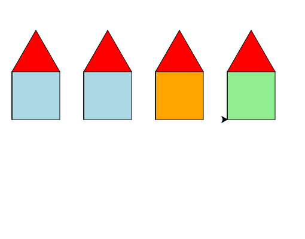

import CodeExercise from '@site/src/components/CodeExercise';

# Stap 7: Elk huis een eigen kleur (if en elif)

:::info
Deze stap gebruikt `if`, `elif` en `else`, uit [If en else](/docs/beslissen/05b-if-else) en [And, or en elif](/docs/beslissen/05c-and-or-elif).
:::

Alle huizen zijn geel. Een tweede parameter `kleur` geeft elk huis zijn
eigen muren:

```python
import turtle

def muren(grootte, kleur):
    turtle.fillcolor(kleur)
    turtle.begin_fill()
    for zijde in range(4):
        turtle.forward(grootte)
        turtle.left(90)
    turtle.end_fill()

muren(80, "lightblue")
```

Bij twee parameters gaan de waarden in dezelfde volgorde mee: `80` wordt
`grootte`, `"lightblue"` wordt `kleur`.

## Opdracht: de kleur hangt af van de plek

Geef ook `huis()` de parameter `kleur`, en kies in de loop voor elk huis een
kleur. Het huis in het midden, op `x` is 0, wordt `"orange"`. De huizen links
daarvan worden `"lightblue"`, de huizen rechts `"lightgreen"`.



<CodeExercise>{`import turtle

def muren(grootte, kleur):
    turtle.fillcolor(kleur)
    turtle.begin_fill()
    for zijde in range(4):
        turtle.forward(grootte)
        turtle.left(90)
    turtle.end_fill()

def dak(grootte):
    turtle.fillcolor("red")
    turtle.begin_fill()
    for zijde in range(3):
        turtle.forward(grootte)
        turtle.left(120)
    turtle.end_fill()

def huis(grootte):
    muren(grootte, "yellow")
    turtle.left(90)
    turtle.forward(grootte)
    turtle.right(90)
    dak(grootte)
    turtle.right(90)
    turtle.forward(grootte)
    turtle.left(90)

for x in range(-240, 240, 120):
    turtle.penup()
    turtle.goto(x, 0)
    turtle.pendown()
    huis(80)`}</CodeExercise>

<details>
<summary>Klik hier voor een tip.</summary>

Maak in de loop, vóór `huis()`, een variabele `kleur` met `if x == 0:`,
`elif x < 0:` en `else:`. Geef die variabele mee: `huis(80, kleur)`.

</details>

<details>
<summary>Klik hier voor de oplossing.</summary>

{/* turtle-plaatje: img/stap-7-kleuren.svg */}

```python
import turtle

def muren(grootte, kleur):
    turtle.fillcolor(kleur)
    turtle.begin_fill()
    for zijde in range(4):
        turtle.forward(grootte)
        turtle.left(90)
    turtle.end_fill()

def dak(grootte):
    turtle.fillcolor("red")
    turtle.begin_fill()
    for zijde in range(3):
        turtle.forward(grootte)
        turtle.left(120)
    turtle.end_fill()

def huis(grootte, kleur):
    muren(grootte, kleur)
    turtle.left(90)
    turtle.forward(grootte)
    turtle.right(90)
    dak(grootte)
    turtle.right(90)
    turtle.forward(grootte)
    turtle.left(90)

for x in range(-240, 240, 120):
    if x == 0:
        kleur = "orange"
    elif x < 0:
        kleur = "lightblue"
    else:
        kleur = "lightgreen"
    turtle.penup()
    turtle.goto(x, 0)
    turtle.pendown()
    huis(80, kleur)
```

De volgorde van de vragen doet ertoe: `x == 0` staat eerst. Stond `x < 0`
bovenaan, dan werkte het hier ook, maar bij `x <= 0` zou het middelste huis
al blauw worden voordat Python bij de vraag naar oranje komt.

</details>

## Er gaat iets mis

{/* foutmelding-van: blok-erboven */}

```python
import turtle

turtle.fillcolor("lichtblauw")
```

```
turtle.TurtleGraphicsError: bad color string: lichtblauw
```

**Oorzaak:** turtle kent alleen Engelse kleurnamen. `"lichtblauw"` zit daar
niet bij.

**Oplossing:** schrijf `"lightblue"`. Een kleur kan ook als code met een
hekje, zoals `"#ff8800"` voor oranje.

Door naar [stap 8: jouw eigen wijk](./stap-8-zelf).
