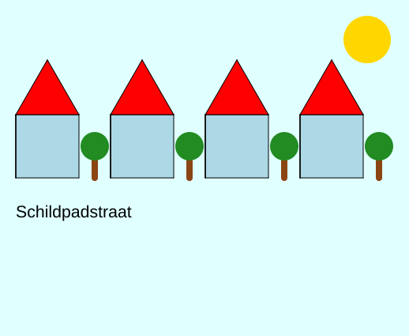

import CodeExercise from '@site/src/components/CodeExercise';

# Stap 8: Jouw eigen wijk (eigen functies)

:::info
Deze stap gebruikt alles uit de vorige stappen, en vooral [Functies](/docs/functies/functies) en [Parameters](/docs/functies/09a-parameters).
:::

Je hebt nu een functie die een huis tekent, in elke maat en kleur, en een
loop die er een straat van maakt. Maak daar je eigen wijk van. Deze
commando's kun je erbij gebruiken:

| Commando | Wat het doet |
|:---|:---|
| `turtle.dot(40, "gold")` | een gevulde stip van 40 breed, op de plek van de schildpad |
| `turtle.pensize(8)` | een dikkere pen; `pensize(1)` is weer dun |
| `turtle.setheading(90)` | kijk omhoog; 0 is rechts, 180 links, 270 omlaag |
| `turtle.circle(30)` | een cirkel met straal 30, links van de schildpad |
| `turtle.write("Hoi", font=("Arial", 16, "normal"))` | tekst op de plek van de schildpad |
| `turtle.bgcolor("lightcyan")` | de kleur van de achtergrond |
| `turtle.hideturtle()` | verberg de schildpad zelf |

## Opdracht: bouw je wijk

Je wijk moet dit hebben:

1. een straat met minstens drie huizen, getekend met `huis()` uit stap 7;
2. minstens één nieuwe functie met een parameter, zoals `boom(x)`;
3. een zon, en de naam van je straat.

Zo kan het eruitzien, maar jouw wijk mag er heel anders uitzien:



<CodeExercise>{`import turtle

def muren(grootte, kleur):
    turtle.fillcolor(kleur)
    turtle.begin_fill()
    for zijde in range(4):
        turtle.forward(grootte)
        turtle.left(90)
    turtle.end_fill()

def dak(grootte):
    turtle.fillcolor("red")
    turtle.begin_fill()
    for zijde in range(3):
        turtle.forward(grootte)
        turtle.left(120)
    turtle.end_fill()

def huis(grootte, kleur):
    muren(grootte, kleur)
    turtle.left(90)
    turtle.forward(grootte)
    turtle.right(90)
    dak(grootte)
    turtle.right(90)
    turtle.forward(grootte)
    turtle.left(90)

for x in range(-240, 240, 120):
    turtle.penup()
    turtle.goto(x, 0)
    turtle.pendown()
    huis(80, "lightblue")`}</CodeExercise>

<details>
<summary>Klik hier voor een tip.</summary>

`penup`, `goto` en `pendown` schrijf je nu steeds opnieuw. Een functie
`naar(x, y)` met die drie regels maakt de rest korter. Een boom is een
dikke bruine lijn omhoog met een groene stip erop. Zet de pen daarna weer
terug, anders tekent het volgende huis met een dikke bruine lijn.

</details>

<details>
<summary>Klik hier voor de oplossing.</summary>

{/* turtle-plaatje: img/stap-8-wijk.svg */}

```python
import turtle

def muren(grootte, kleur):
    turtle.fillcolor(kleur)
    turtle.begin_fill()
    for zijde in range(4):
        turtle.forward(grootte)
        turtle.left(90)
    turtle.end_fill()

def dak(grootte):
    turtle.fillcolor("red")
    turtle.begin_fill()
    for zijde in range(3):
        turtle.forward(grootte)
        turtle.left(120)
    turtle.end_fill()

def huis(grootte, kleur):
    muren(grootte, kleur)
    turtle.left(90)
    turtle.forward(grootte)
    turtle.right(90)
    dak(grootte)
    turtle.right(90)
    turtle.forward(grootte)
    turtle.left(90)

def naar(x, y):
    turtle.penup()
    turtle.goto(x, y)
    turtle.pendown()

def boom(x):
    naar(x, 0)
    turtle.pencolor("saddlebrown")
    turtle.pensize(8)
    turtle.setheading(90)
    turtle.forward(40)
    turtle.dot(36, "forestgreen")
    turtle.setheading(0)
    turtle.pensize(1)
    turtle.pencolor("black")

turtle.bgcolor("lightcyan")
naar(205, 175)
turtle.dot(60, "gold")

for x in range(-240, 240, 120):
    naar(x, 0)
    huis(80, "lightblue")

for x in range(-140, 240, 120):
    boom(x)

naar(-240, -50)
turtle.write("Schildpadstraat", font=("Arial", 16, "normal"))
turtle.hideturtle()
```

De bomen staan tussen de huizen: het eerste huis eindigt bij -160 en het
tweede begint bij -120, dus de eerste boom staat op -140.

</details>

## Mogelijke uitbreidingen

- Een deur en ramen in `huis()`, met hun eigen functies `deur()` en `raam()`.
- Nog een straat erboven of eronder, met kleinere huizen.
- 's Nachts: een donkere achtergrond, een maan en gele ramen.
- Huizen van verschillende hoogte, met een loop over een lijst hoogtes.
  Lijsten komen in [Lijsten](/docs/data/10a-lijsten-basis).

Terug naar [het overzicht van de projecten](/docs/projecten/).
