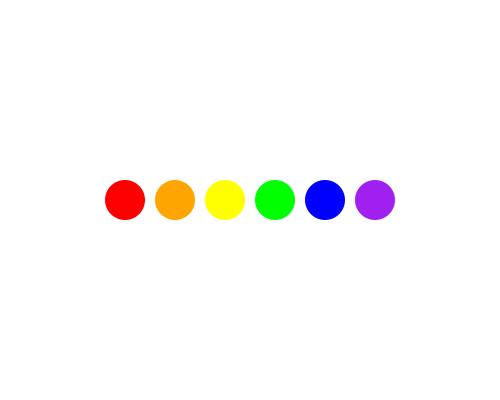

import CodeExercise from '@site/src/components/CodeExercise';

# Stap 1: Een rij stippen (een lijst)

:::info
Deze stap gebruikt lijsten, uit [Lijsten](/docs/data/10a-lijsten-basis).
:::

Tot nu toe liep je for-loop over `range()`: 0, 1, 2, … Een for-loop kan ook
over een lijst lopen. Dan is de variabele elke ronde het volgende ding uit
de lijst:

```python
import turtle

kleuren = ["red", "orange", "yellow"]

turtle.penup()
for kleur in kleuren:
    turtle.dot(40, kleur)
    turtle.forward(50)
```

<CodeExercise>{`import turtle

kleuren = ["red", "orange", "yellow"]

turtle.penup()
for kleur in kleuren:
    turtle.dot(40, kleur)
    turtle.forward(50)`}</CodeExercise>

De eerste ronde is `kleur` gelijk aan `"red"`, dan `"orange"`, dan
`"yellow"`. Er komen precies zoveel stippen als er kleuren in de lijst staan.
Zet je er een kleur bij, dan komt er vanzelf een stip bij.

## Opdracht: zes kleuren

Maak de lijst zes kleuren lang: rood, oranje, geel, groen, blauw en paars.
Begin op `(-125, 0)`, zodat de rij in het midden staat, en verberg de
schildpad.



<details>
<summary>Klik hier voor een tip.</summary>

De Engelse namen zijn `"green"`, `"blue"` en `"purple"`. Met
`turtle.goto(-125, 0)` na `penup()` begin je links, en `turtle.hideturtle()`
verbergt de schildpad.

</details>

<details>
<summary>Klik hier voor de oplossing.</summary>

{/* turtle-plaatje: img/stap-1-stippen.svg */}

```python
import turtle

kleuren = ["red", "orange", "yellow", "green", "blue", "purple"]

turtle.hideturtle()
turtle.penup()
turtle.goto(-125, 0)
for kleur in kleuren:
    turtle.dot(40, kleur)
    turtle.forward(50)
```

</details>

## Er gaat iets mis

{/* foutmelding-van: import turtle\nfor kleur in ["red" "orange"]:\n    turtle.dot(40, kleur) */}

```
turtle.TurtleGraphicsError: bad color string: redorange
```

**Oorzaak:** er ontbreekt een komma in de lijst: `["red" "orange"]`. Twee
teksten zonder komma ertussen plakt Python aan elkaar, dus de lijst heeft
één kleur, `"redorange"`, en die bestaat niet.

**Oplossing:** zet tussen elke twee dingen in een lijst een komma:
`["red", "orange"]`.

Door naar [stap 2: de regenboog](./stap-2-regenboog).
