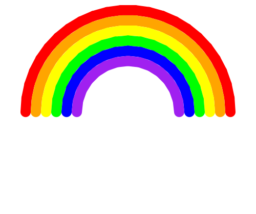

import CodeExercise from '@site/src/components/CodeExercise';

# Stap 2: De regenboog (een lijst en een variabele)

Een regenboog is een halve cirkel per kleur. Eén boog teken je zo:

```python
import turtle

straal = 200

turtle.pensize(20)
turtle.penup()
turtle.goto(-straal, 0)
turtle.setheading(90)
turtle.pendown()
turtle.circle(-straal, 180)
```

<CodeExercise>{`import turtle

straal = 200

turtle.pensize(20)
turtle.penup()
turtle.goto(-straal, 0)
turtle.setheading(90)
turtle.pendown()
turtle.circle(-straal, 180)`}</CodeExercise>

- De schildpad begint links, op `(-straal, 0)`.
- `turtle.setheading(90)` laat hem recht omhoog kijken. Bij 0 kijkt hij naar
  rechts, bij 90 omhoog.
- `turtle.circle(-straal, 180)` loopt een halve cirkel. Met een min voor de
  straal buigt de boog naar rechts, over de top heen.

## Opdracht: een regenboog

Teken voor elke kleur uit de lijst van stap 1 een boog. Elke volgende boog
is 20 kleiner dan de vorige, zodat hij precies binnen de vorige past.



<details>
<summary>Klik hier voor een tip.</summary>

Alles vanaf `turtle.penup()` gaat in een for-loop over `kleuren`. Zet in de
loop ook `turtle.pencolor(kleur)`, en maak onderaan de loop `straal` 20
kleiner met `straal -= 20`.

</details>

<details>
<summary>Klik hier voor de oplossing.</summary>

{/* turtle-plaatje: img/stap-2-regenboog.svg */}

```python
import turtle

kleuren = ["red", "orange", "yellow", "green", "blue", "purple"]
straal = 200

turtle.hideturtle()
turtle.pensize(20)
for kleur in kleuren:
    turtle.penup()
    turtle.goto(-straal, 0)
    turtle.setheading(90)
    turtle.pendown()
    turtle.pencolor(kleur)
    turtle.circle(-straal, 180)
    straal -= 20
```

</details>

## Mogelijke uitbreidingen

- Een wolk aan elk uiteinde, van witte stippen op een lichtblauwe
  achtergrond (`turtle.bgcolor("lightblue")`).
- Een regenboog met meer kleuren: zet ze in de lijst, en kijk of de straal
  genoeg is.
- Combineer het met je straat uit
  [Een straat vol huizen](/docs/projecten/turtle/straat-vol-huizen/stap-1-functies).

Terug naar [het overzicht van de turtle-projecten](/docs/projecten/turtle/).
