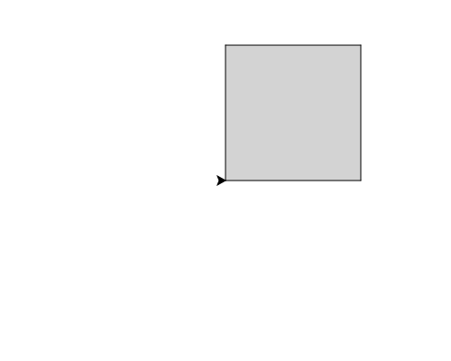

import CodeExercise from '@site/src/components/CodeExercise';

# Stap 1: Een hoofd in elke maat (een variabele)

:::info
Deze stap gebruikt variabelen, uit [Jij als variabele](/docs/basis/jij-als-variabele).
:::

In dit project teken je een robotkop: een vierkant hoofd met ogen en een
mond. Het hoofd is een vierkant, zoals in [Een huis](/docs/projecten/turtle/een-huis/stap-1-vierkant).
Alleen staat de maat nu in een variabele:

```python
import turtle

maat = 100

turtle.forward(maat)
turtle.left(90)
turtle.forward(maat)
turtle.left(90)
turtle.forward(maat)
turtle.left(90)
turtle.forward(maat)
turtle.left(90)
```

Wil je een groter hoofd, dan verander je alleen de regel `maat = 100`. De
vier `forward(maat)`-regels groeien vanzelf mee. Met losse getallen had je
vier regels moeten aanpassen, en was je er vast één vergeten.

## Opdracht: een grijs hoofd

Maak een hoofd van 150 breed, ingekleurd met de kleur uit een tweede
variabele `kleur`.



<CodeExercise>{`import turtle

maat = 100

turtle.forward(maat)
turtle.left(90)
turtle.forward(maat)
turtle.left(90)
turtle.forward(maat)
turtle.left(90)
turtle.forward(maat)
turtle.left(90)`}</CodeExercise>

<details>
<summary>Klik hier voor een tip.</summary>

Zet onder `maat` een regel `kleur = "lightgray"`. Daarna gebruik je
`turtle.fillcolor(kleur)`, zonder aanhalingstekens: je bedoelt de variabele,
niet het woord `kleur`.

</details>

<details>
<summary>Klik hier voor de oplossing.</summary>

{/* turtle-plaatje: img/stap-1-hoofd.svg */}

```python
import turtle

maat = 150
kleur = "lightgray"

turtle.fillcolor(kleur)
turtle.begin_fill()
turtle.forward(maat)
turtle.left(90)
turtle.forward(maat)
turtle.left(90)
turtle.forward(maat)
turtle.left(90)
turtle.forward(maat)
turtle.left(90)
turtle.end_fill()
```

</details>

## Er gaat iets mis

{/* foutmelding-van: blok-erboven */}

```python
import turtle

kleur = "lightgray"
turtle.fillcolor("kleur")
```

```
turtle.TurtleGraphicsError: bad color string: kleur
```

**Oorzaak:** met aanhalingstekens is `"kleur"` het woord kleur, en dat is
geen kleur die turtle kent.

**Oplossing:** schrijf de variabele zonder aanhalingstekens:
`turtle.fillcolor(kleur)`.

Door naar [stap 2: ogen die meegroeien](./stap-2-ogen).
