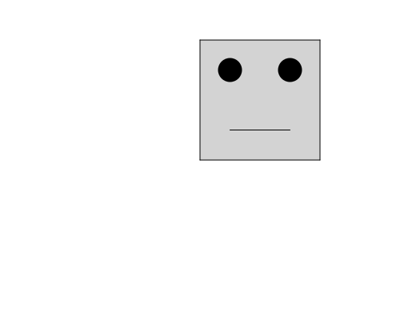

import CodeExercise from '@site/src/components/CodeExercise';

# Stap 2: Ogen die meegroeien (rekenen met een variabele)

:::info
Deze stap rekent met variabelen, uit [Rekenmachine](/docs/basis/rekenmachine).
:::

Het hoofd heeft ogen nodig. Een oog is een stip, en die zet je met
`turtle.dot()`. Eerst til je de pen op en loop je naar de plek van het oog:

```python
import turtle

maat = 150

turtle.penup()
turtle.goto(maat / 4, maat * 3 / 4)
turtle.dot(maat / 5, "black")
```

- `turtle.penup()` tilt de pen op: de schildpad loopt, maar tekent niet.
- `turtle.goto(x, y)` loopt naar een punt. Het eerste getal is hoe ver naar
  rechts, het tweede hoe ver omhoog. Linksonder in het hoofd is `(0, 0)`.
- `turtle.dot(maat / 5, "black")` zet een zwarte stip van `maat / 5` breed.

Alle getallen komen uit `maat`. Het oog staat op een kwart van de breedte, en
op driekwart van de hoogte. Maak je het hoofd groter, dan schuift het oog mee.

## Opdracht: een robotkop

Geef het hoofd uit stap 1 twee ogen en een mond. De mond is een lijn van
`(maat / 4, maat / 4)` naar `(maat * 3 / 4, maat / 4)`. Zet daarna `maat`
eens op 80: het hele gezicht moet meekrimpen.



<CodeExercise>{`import turtle

maat = 150
kleur = "lightgray"

turtle.fillcolor(kleur)
turtle.begin_fill()
turtle.forward(maat)
turtle.left(90)
turtle.forward(maat)
turtle.left(90)
turtle.forward(maat)
turtle.left(90)
turtle.forward(maat)
turtle.left(90)
turtle.end_fill()`}</CodeExercise>

<details>
<summary>Klik hier voor een tip.</summary>

Het tweede oog staat op `(maat * 3 / 4, maat * 3 / 4)`. Voor de mond loop je
met de pen omhoog naar het begin, zet je de pen neer met `turtle.pendown()`,
en loop je met `goto` naar het eind.

</details>

<details>
<summary>Klik hier voor de oplossing.</summary>

{/* turtle-plaatje: img/stap-2-robotkop.svg */}

```python
import turtle

maat = 150
kleur = "lightgray"

turtle.fillcolor(kleur)
turtle.begin_fill()
turtle.forward(maat)
turtle.left(90)
turtle.forward(maat)
turtle.left(90)
turtle.forward(maat)
turtle.left(90)
turtle.forward(maat)
turtle.left(90)
turtle.end_fill()

turtle.penup()
turtle.goto(maat / 4, maat * 3 / 4)
turtle.dot(maat / 5, "black")
turtle.goto(maat * 3 / 4, maat * 3 / 4)
turtle.dot(maat / 5, "black")

turtle.goto(maat / 4, maat / 4)
turtle.pendown()
turtle.goto(maat * 3 / 4, maat / 4)
turtle.hideturtle()
```

De laatste regel verbergt de schildpad, anders staat hij als een pijltje aan
het eind van de mond.

</details>

## Er gaat iets mis

Je vergeet `turtle.penup()` voor het eerste oog. Dan trekt de schildpad een
schuine streep van de hoek van het hoofd naar het oog.

**Oorzaak:** `goto` tekent net als `forward`, zolang de pen omlaag staat.

**Oplossing:** til de pen op vóór je naar een nieuwe plek loopt, en zet hem
pas neer als je weer wilt tekenen.

Door naar het volgende project: [Een verkeerslicht](/docs/projecten/turtle/verkeerslicht/stap-1-if-else).
