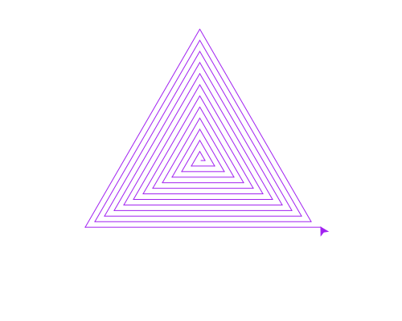

import CodeExercise from '@site/src/components/CodeExercise';

# Stap 1: Een vierkante spiraal (while-loop)

:::info
Deze stap gebruikt de while-loop, uit [De while-loop](/docs/herhalen/while-loop).
:::

Bij een vierkant is elke zijde even lang. Maak je elke zijde een stukje
langer dan de vorige, dan draait de schildpad naar buiten: een spiraal. Hoe
vaak dat moet, weet je niet precies. Wel wanneer hij moet stoppen: als de
lijn te lang wordt. Daarvoor is de while-loop:

```python
import turtle

lengte = 5

while lengte < 200:
    turtle.forward(lengte)
    turtle.left(90)
    lengte += 5
```

<CodeExercise>{`import turtle

lengte = 5

while lengte < 200:
    turtle.forward(lengte)
    turtle.left(90)
    lengte += 5`}</CodeExercise>

Zolang `lengte` kleiner is dan 200, loopt de schildpad een stuk, draait hij,
en wordt `lengte` 5 groter. Bij 200 is de vraag niet meer waar, en stopt de
loop.

## Opdracht: een driehoekige spiraal

Maak een spiraal met drie hoeken in plaats van vier, die doorgaat tot de
lijn 300 lang is. Maak elke lijn 8 langer dan de vorige, en teken in
`"purple"`.



<details>
<summary>Klik hier voor een tip.</summary>

Een driehoek draait 120 graden per hoek. Verander ook de 200 in de vraag en
de 5 onderaan de loop.

</details>

<details>
<summary>Klik hier voor de oplossing.</summary>

{/* turtle-plaatje: img/stap-1-driehoek.svg */}

```python
import turtle

turtle.pencolor("purple")
lengte = 5

while lengte < 300:
    turtle.forward(lengte)
    turtle.left(120)
    lengte += 8
```

</details>

## Er gaat iets mis

{/* niet-draaien: een oneindige loop, die hier nooit zou stoppen */}

```python
import turtle

lengte = 5

while lengte < 200:
    turtle.forward(lengte)
    turtle.left(90)
```

De schildpad blijft rondjes lopen over hetzelfde vierkantje, en je programma
stopt nooit. In de speeltuin loopt je browsertab dan vast.

**Oorzaak:** `lengte += 5` ontbreekt. `lengte` blijft 5, dus `lengte < 200`
blijft voor altijd waar.

**Oplossing:** zorg dat de loop iets verandert aan wat de vraag bovenaan
controleert. Kopieer je code eerst naar een kladblok voordat je een while-loop
probeert, dan ben je hem niet kwijt als de tab vastloopt.

Door naar [stap 2: stippen tot de rand](./stap-2-tot-de-rand).
