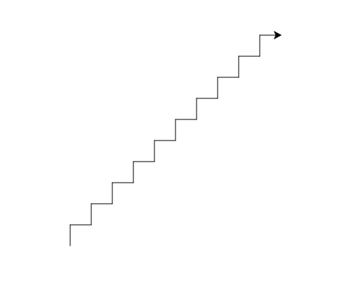

import CodeExercise from '@site/src/components/CodeExercise';

# Stap 2: Stippen tot de rand (while met een positie)

De vraag in een while-loop mag over de schildpad zelf gaan.
`turtle.xcor()` geeft hoe ver hij naar rechts staat. Zo loopt hij tot de
rand, zonder dat jij hoeft uit te rekenen hoeveel stappen dat zijn:

```python
import turtle

turtle.penup()
turtle.goto(-200, 0)

while turtle.xcor() < 200:
    turtle.dot(20, "red")
    turtle.forward(40)
```

<CodeExercise>{`import turtle

turtle.penup()
turtle.goto(-200, 0)

while turtle.xcor() < 200:
    turtle.dot(20, "red")
    turtle.forward(40)`}</CodeExercise>

Elke ronde zet de schildpad een stip en loopt hij 40 verder. Zodra hij op 200
of verder staat, stopt de loop. Tel zelf maar: dat zijn tien stippen.

## Opdracht: een trap

Teken een trap van linksonder naar rechtsboven: steeds 30 omhoog en 30 naar
rechts, zolang de schildpad lager staat dan 140. Begin op `(-150, -150)`.



<CodeExercise>{`import turtle

turtle.penup()
turtle.goto(-150, -150)
turtle.pendown()
`}</CodeExercise>

<details>
<summary>Klik hier voor een tip.</summary>

`turtle.ycor()` geeft hoe hoog de schildpad staat. Een trede is
`left(90)`, `forward(30)`, `right(90)`, `forward(30)`. Na een trede kijkt
de schildpad weer naar rechts.

</details>

<details>
<summary>Klik hier voor de oplossing.</summary>

{/* turtle-plaatje: img/stap-2-trap.svg */}

```python
import turtle

turtle.penup()
turtle.goto(-150, -150)
turtle.pendown()

while turtle.ycor() < 140:
    turtle.left(90)
    turtle.forward(30)
    turtle.right(90)
    turtle.forward(30)
```

</details>

Door naar het volgende project: [Een straat vol huizen](/docs/projecten/turtle/straat-vol-huizen/stap-1-functies).
