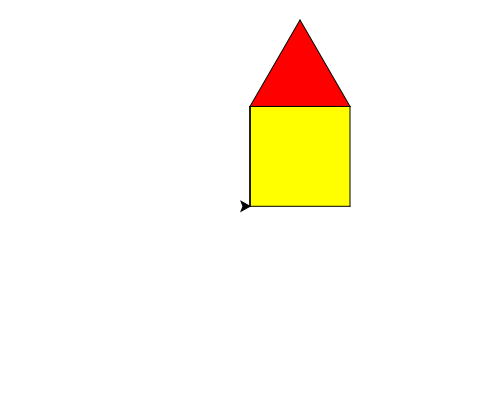

import CodeExercise from '@site/src/components/CodeExercise';

# Stap 1: Het huis in functies (def)

:::info
Deze stap gebruikt functies, uit [Functies](/docs/functies/functies).
:::

Het huis uit [Een huis](/docs/projecten/turtle/een-huis/stap-2-huis) is een
lange lap code. Straks wil je er een hele straat van maken, en dan wil je
niet voor elk huis alles opnieuw typen. Zet het daarom in functies, met een
naam die zegt wat ze tekenen. De muren gaan met de for-loop uit
[Veelhoeken en sterren](/docs/projecten/turtle/veelhoeken/stap-1-vierkant):

```python
import turtle

def muren():
    turtle.fillcolor("yellow")
    turtle.begin_fill()
    for zijde in range(4):
        turtle.forward(100)
        turtle.left(90)
    turtle.end_fill()

muren()
```

Alles onder `def muren():` springt vier spaties in, en de loop daarin nog
vier. Er gebeurt pas iets als je de functie aanroept, op de laatste regel.

## Opdracht: `dak()` en `huis()`

Maak ook een functie `dak()` die het rode dak tekent, en een functie
`huis()` die eerst `muren()` aanroept, dan naar linksboven loopt zoals in Een huis, en dan
`dak()` aanroept. Roep aan het eind alleen `huis()` aan.

Laat `huis()` de schildpad daarna terugbrengen naar waar hij begon:
linksonder, kijkend naar rechts. Dat lijkt nu overbodig, maar in stap 3
teken je huis na huis, en dan moet elk huis op dezelfde manier beginnen.



<CodeExercise>{`import turtle

def muren():
    turtle.fillcolor("yellow")
    turtle.begin_fill()
    for zijde in range(4):
        turtle.forward(100)
        turtle.left(90)
    turtle.end_fill()

muren()`}</CodeExercise>

<details>
<summary>Klik hier voor een tip.</summary>

Na het dak staat de schildpad linksboven en kijkt hij naar rechts. Terug
naar linksonder is hetzelfde als omhoog, maar dan andersom:
`right(90)`, `forward(100)`, `left(90)`.

</details>

<details>
<summary>Klik hier voor de oplossing.</summary>

{/* turtle-plaatje: img/stap-1-huis.svg */}

```python
import turtle

def muren():
    turtle.fillcolor("yellow")
    turtle.begin_fill()
    for zijde in range(4):
        turtle.forward(100)
        turtle.left(90)
    turtle.end_fill()

def dak():
    turtle.fillcolor("red")
    turtle.begin_fill()
    for zijde in range(3):
        turtle.forward(100)
        turtle.left(120)
    turtle.end_fill()

def huis():
    muren()
    turtle.left(90)
    turtle.forward(100)
    turtle.right(90)
    dak()
    turtle.right(90)
    turtle.forward(100)
    turtle.left(90)

huis()
```

Het plaatje is hetzelfde als in Een huis. Het verschil zit in de code: `huis()`
is nu één regel, en die kun je zo vaak aanroepen als je wilt.

</details>

Door naar [stap 2: huizen in elke maat](./stap-2-parameters).
