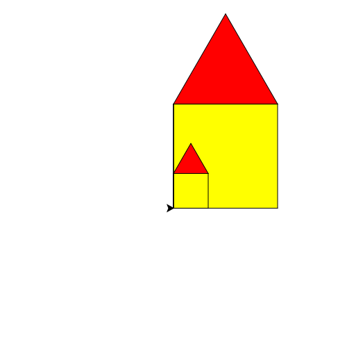

import CodeExercise from '@site/src/components/CodeExercise';

# Stap 2: Huizen in elke maat (parameters)

:::info
Deze stap gebruikt parameters, uit [Parameters](/docs/functies/09a-parameters).
:::

Elk huis is nu 100 stappen breed, want dat getal staat vast in de functies.
Maak er een parameter van, dan kies je bij elke aanroep hoe groot het huis
wordt:

```python
import turtle

def muren(grootte):
    turtle.fillcolor("yellow")
    turtle.begin_fill()
    for zijde in range(4):
        turtle.forward(grootte)
        turtle.left(90)
    turtle.end_fill()

muren(150)
muren(50)
```

Overal waar `100` stond, staat nu `grootte`. Bij `muren(150)` is `grootte`
150, bij `muren(50)` is het 50.

## Opdracht: een huis met een hondenhok

Geef ook `dak()` en `huis()` een parameter `grootte`, en teken daarmee
`huis(150)` en daarna `huis(50)`: een groot huis met een hondenhok ervoor.



<CodeExercise>{`import turtle

def muren(grootte):
    turtle.fillcolor("yellow")
    turtle.begin_fill()
    for zijde in range(4):
        turtle.forward(grootte)
        turtle.left(90)
    turtle.end_fill()

muren(150)
muren(50)`}</CodeExercise>

<details>
<summary>Klik hier voor een tip.</summary>

`huis(grootte)` geeft zijn `grootte` door: hij roept `muren(grootte)` en
`dak(grootte)` aan. Ook de stappen omhoog en terug naar beneden zijn nu
`forward(grootte)`.

</details>

<details>
<summary>Klik hier voor de oplossing.</summary>

{/* turtle-plaatje: img/stap-2-hondenhok.svg */}

```python
import turtle

def muren(grootte):
    turtle.fillcolor("yellow")
    turtle.begin_fill()
    for zijde in range(4):
        turtle.forward(grootte)
        turtle.left(90)
    turtle.end_fill()

def dak(grootte):
    turtle.fillcolor("red")
    turtle.begin_fill()
    for zijde in range(3):
        turtle.forward(grootte)
        turtle.left(120)
    turtle.end_fill()

def huis(grootte):
    muren(grootte)
    turtle.left(90)
    turtle.forward(grootte)
    turtle.right(90)
    dak(grootte)
    turtle.right(90)
    turtle.forward(grootte)
    turtle.left(90)

huis(150)
huis(50)
```

Het hondenhok staat precies in de hoek, omdat `huis(150)` de schildpad
terugbrengt naar linksonder.

</details>

## Er gaat iets mis

{/* foutmelding-van: blok-erboven */}

```python
import turtle

def muren(grootte):
    for zijde in range(4):
        turtle.forward(grootte)
        turtle.left(90)

muren()
```

```
TypeError: muren() missing 1 required positional argument: 'grootte'
```

**Oorzaak:** `muren` heeft een parameter, dus Python verwacht bij de aanroep
een waarde tussen de haakjes. `muren()` geeft er geen.

**Oplossing:** geef de grootte mee, bijvoorbeeld `muren(100)`.

Door naar [stap 3: een hele straat](./stap-3-straat).
