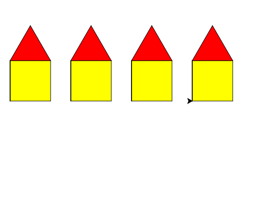

import CodeExercise from '@site/src/components/CodeExercise';

# Stap 3: Een hele straat (range met stappen)

:::info
Deze stap gebruikt `range` met een stapgrootte, uit [Range met stappen](/docs/herhalen/06b-range-stappen).
:::

Voor een straat moet de schildpad naar een nieuwe plek lopen zonder een
lijn te trekken. Dat ken je van de ogen van de
[robotkop](/docs/projecten/turtle/robotkop/stap-2-ogen):

```python
import turtle

turtle.penup()
turtle.goto(-200, 0)
turtle.pendown()
turtle.forward(50)
```

Pen omhoog, naar de plek, pen omlaag. Het midden van het scherm is `(0, 0)`,
dus `-200` ligt links.

## Opdracht: vier huizen op een rij

Teken vier huizen van 80 breed naast elkaar. Het eerste huis begint op
`(-240, 0)`, en elk volgend huis 120 stappen verder naar rechts.



<CodeExercise>{`import turtle

def muren(grootte):
    turtle.fillcolor("yellow")
    turtle.begin_fill()
    for zijde in range(4):
        turtle.forward(grootte)
        turtle.left(90)
    turtle.end_fill()

def dak(grootte):
    turtle.fillcolor("red")
    turtle.begin_fill()
    for zijde in range(3):
        turtle.forward(grootte)
        turtle.left(120)
    turtle.end_fill()

def huis(grootte):
    muren(grootte)
    turtle.left(90)
    turtle.forward(grootte)
    turtle.right(90)
    dak(grootte)
    turtle.right(90)
    turtle.forward(grootte)
    turtle.left(90)

huis(80)`}</CodeExercise>

<details>
<summary>Klik hier voor een tip.</summary>

De plekken zijn -240, -120, 0 en 120. Dat is `range(-240, 240, 120)`: begin
bij -240, stop vóór 240, en tel steeds 120 op. In de loop doe je `penup`,
`goto(x, 0)`, `pendown` en `huis(80)`.

</details>

<details>
<summary>Klik hier voor de oplossing.</summary>

{/* turtle-plaatje: img/stap-3-straat.svg */}

```python
import turtle

def muren(grootte):
    turtle.fillcolor("yellow")
    turtle.begin_fill()
    for zijde in range(4):
        turtle.forward(grootte)
        turtle.left(90)
    turtle.end_fill()

def dak(grootte):
    turtle.fillcolor("red")
    turtle.begin_fill()
    for zijde in range(3):
        turtle.forward(grootte)
        turtle.left(120)
    turtle.end_fill()

def huis(grootte):
    muren(grootte)
    turtle.left(90)
    turtle.forward(grootte)
    turtle.right(90)
    dak(grootte)
    turtle.right(90)
    turtle.forward(grootte)
    turtle.left(90)

for x in range(-240, 240, 120):
    turtle.penup()
    turtle.goto(x, 0)
    turtle.pendown()
    huis(80)
```

</details>

## Er gaat iets mis

Je vergeet `turtle.penup()` in de loop. Dan trekt de schildpad bij elke
`goto` een lijn, en staan de huizen met een streep over de grond aan elkaar
vast.

**Oorzaak:** `goto` tekent, net als `forward`, zolang de pen omlaag staat.

**Oplossing:** zet vóór de `goto` een `penup()`, en erna een `pendown()`.
Vergeet je die tweede, dan tekent `huis(80)` niets meer, behalve de kleur.

## Mogelijke uitbreidingen

- Geef `huis()` een tweede parameter `kleur`, en kies met `if` en `elif` per
  huis een andere kleur, zoals bij het verkeerslicht.
- Zet bomen tussen de huizen: een dikke bruine lijn met een groene stip
  erop, in een eigen functie `boom(x)`.
- Een zon met `turtle.dot(60, "gold")`, en de naam van je straat met
  `turtle.write("Schildpadstraat", font=("Arial", 16, "normal"))`.
- Een deur en ramen in `huis()`, met hun eigen functies `deur()` en `raam()`.

Door naar het volgende project: [Een regenboog](/docs/projecten/turtle/regenboog/stap-1-stippen).
