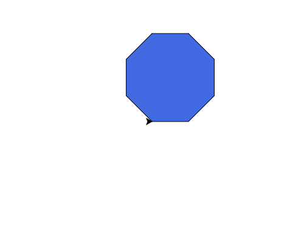

import CodeExercise from '@site/src/components/CodeExercise';

# Stap 2: Elke veelhoek (een loop met een variabele)

Een vierkant draait vier keer 90 graden, een driehoek drie keer 120. Samen
is dat allebei 360: de schildpad draait precies één keer rond. Dat geldt
voor elke veelhoek. Met het aantal hoeken in een variabele teken je ze
allemaal met dezelfde code:

```python
import turtle

hoeken = 6

for zijde in range(hoeken):
    turtle.forward(80)
    turtle.left(360 / hoeken)
```

Dit tekent een zeshoek: zes zijden, en na elke zijde 60 graden draaien.
Verander `hoeken` in 5 of 12, en je krijgt een vijfhoek of een twaalfhoek.

## Opdracht: een achthoek

Teken een gevulde blauwe achthoek met zijden van 60.



<CodeExercise>{`import turtle

hoeken = 6

for zijde in range(hoeken):
    turtle.forward(80)
    turtle.left(360 / hoeken)`}</CodeExercise>

<details>
<summary>Klik hier voor een tip.</summary>

Verander `hoeken` en de lengte van de zijde. Zet `fillcolor`,
`begin_fill()` vóór de loop en `end_fill()` erna, zonder inspringen: de hele
achthoek moet ingekleurd worden, niet elke zijde apart.

</details>

<details>
<summary>Klik hier voor de oplossing.</summary>

{/* turtle-plaatje: img/stap-2-achthoek.svg */}

```python
import turtle

hoeken = 8

turtle.fillcolor("royalblue")
turtle.begin_fill()
for zijde in range(hoeken):
    turtle.forward(60)
    turtle.left(360 / hoeken)
turtle.end_fill()
```

</details>

Door naar [stap 3: een ster](./stap-3-ster).
