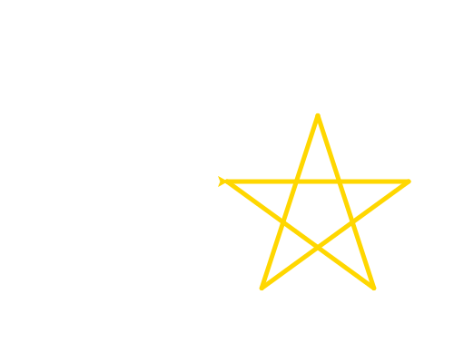

import CodeExercise from '@site/src/components/CodeExercise';

# Stap 3: Een ster (for-loop)

Draait de schildpad bij elke punt verder dan bij een vijfhoek, dan kruisen
de lijnen elkaar en krijg je een ster. Probeer maar:

```python
import turtle

for punt in range(5):
    turtle.forward(150)
    turtle.right(144)
```

<CodeExercise>{`import turtle

for punt in range(5):
    turtle.forward(150)
    turtle.right(144)`}</CodeExercise>

Bij een vijfhoek draait de schildpad 5 keer 72 graden: samen één keer rond.
Bij de ster draait hij 5 keer 144 graden: samen twee keer rond. Daarom komt
hij na vijf lijnen weer op zijn beginpunt uit.

## Opdracht: een gouden ster

Teken een ster met punten van 200, in de kleur `"gold"` en met een pen van 5
breed.



<details>
<summary>Klik hier voor een tip.</summary>

`turtle.pencolor("gold")` en `turtle.pensize(5)` zet je vóór de loop. In de
loop verandert alleen de 150 in 200.

</details>

<details>
<summary>Klik hier voor de oplossing.</summary>

{/* turtle-plaatje: img/stap-3-ster.svg */}

```python
import turtle

turtle.pencolor("gold")
turtle.pensize(5)

for punt in range(5):
    turtle.forward(200)
    turtle.right(144)
```

Probeer ook eens `range(7)` met `right(360 * 3 / 7)`: een ster met zeven
punten.

</details>

Door naar het volgende project: [Een spiraal](/docs/projecten/turtle/spiraal/stap-1-spiraal).
