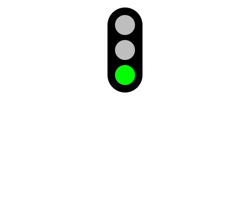

import CodeExercise from '@site/src/components/CodeExercise';

# Stap 1: Aan of uit (if en else)

:::info
Deze stap gebruikt `if` en `else`, uit [If en else](/docs/beslissen/05b-if-else).
:::

Een verkeerslicht is een zwarte kast met drie lampen. De kast is één heel
dikke lijn, de lampen zijn stippen. Of de bovenste lamp brandt, hangt af van
de variabele `stand`:

```python
import turtle

stand = "rood"

turtle.hideturtle()
turtle.penup()
turtle.goto(0, 50)
turtle.pendown()
turtle.pensize(70)
turtle.goto(0, 150)

if stand == "rood":
    turtle.dot(40, "red")
else:
    turtle.dot(40, "gray")
```

<CodeExercise>{`import turtle

stand = "rood"

turtle.hideturtle()
turtle.penup()
turtle.goto(0, 50)
turtle.pendown()
turtle.pensize(70)
turtle.goto(0, 150)

if stand == "rood":
    turtle.dot(40, "red")
else:
    turtle.dot(40, "gray")`}</CodeExercise>

- `turtle.hideturtle()` verbergt de schildpad, zodat hij niet over de lampen
  heen staat.
- `turtle.pensize(70)` maakt de pen 70 breed. De lijn van `(0, 50)` naar
  `(0, 150)` wordt zo een zwarte kast met ronde hoeken.
- Na de kast staat de schildpad bovenaan, op de plek van de rode lamp. Is
  `stand` gelijk aan `"rood"`, dan wordt die stip rood. Anders grijs.

Verander `"rood"` eens in `"groen"` en druk op Uitvoeren.

## Opdracht: de groene lamp

Geef het verkeerslicht ook een middelste en een onderste lamp. De middelste
is altijd grijs. De onderste is groen als `stand` gelijk is aan `"groen"`,
en anders grijs. Zet `stand` op `"groen"`.



<details>
<summary>Klik hier voor een tip.</summary>

De middelste lamp staat op `(0, 100)`, de onderste op `(0, 50)`. Til de pen
op voor je erheen loopt, anders tekent de dikke pen over de lampen heen. Voor
de onderste lamp schrijf je een tweede `if` met `else`.

</details>

<details>
<summary>Klik hier voor de oplossing.</summary>

{/* turtle-plaatje: img/stap-1-groen.svg */}

```python
import turtle

stand = "groen"

turtle.hideturtle()
turtle.penup()
turtle.goto(0, 50)
turtle.pendown()
turtle.pensize(70)
turtle.goto(0, 150)

if stand == "rood":
    turtle.dot(40, "red")
else:
    turtle.dot(40, "gray")

turtle.penup()
turtle.goto(0, 100)
turtle.dot(40, "gray")

turtle.goto(0, 50)
if stand == "groen":
    turtle.dot(40, "green")
else:
    turtle.dot(40, "gray")
```

`dot` tekent ook met de pen omhoog: een stip zet de schildpad altijd.

</details>

## Er gaat iets mis

{/* niet-compileren: bewuste syntaxfout, één = in de if */}

```python
stand = "rood"
if stand = "rood":
    print("Stop")
```

{/* foutmelding-van: stand = "rood"\nif stand = "rood":\n    pass */}

```
SyntaxError: invalid syntax. Maybe you meant '==' or ':=' instead of '='?
```

**Oorzaak:** één `=` geeft een variabele een waarde. Om te vergelijken
gebruik je er twee.

**Oplossing:** schrijf `if stand == "rood":`. Python raadt het zelf al.

Door naar [stap 2: drie standen](./stap-2-elif).
