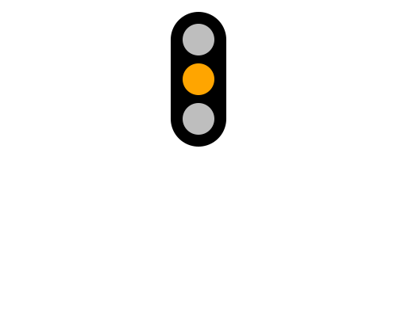

import CodeExercise from '@site/src/components/CodeExercise';

# Stap 2: Drie standen (elif)

:::info
Deze stap gebruikt `elif`, uit [And, or en elif](/docs/beslissen/05c-and-or-elif).
:::

Een verkeerslicht heeft drie standen: rood, oranje en groen. Met `elif` stel
je na de eerste vraag een tweede, en `else` vangt de rest op:

```python
import turtle

stand = "oranje"

if stand == "rood":
    kleur = "red"
elif stand == "oranje":
    kleur = "orange"
else:
    kleur = "green"

turtle.dot(40, kleur)
```

Python loopt de vragen van boven naar beneden af, en doet alleen het blok
van de eerste die klopt. Hier is dat `elif`, dus de stip wordt oranje.

## Opdracht: precies één lamp aan

Teken het hele verkeerslicht. Alle drie de lampen zijn grijs, behalve die
van de stand. Zet `stand` op `"oranje"`.



<CodeExercise>{`import turtle

stand = "oranje"

turtle.hideturtle()
turtle.penup()
turtle.goto(0, 50)
turtle.pendown()
turtle.pensize(70)
turtle.goto(0, 150)
turtle.penup()

boven = "gray"
midden = "gray"
onder = "gray"

turtle.goto(0, 150)
turtle.dot(40, boven)
turtle.goto(0, 100)
turtle.dot(40, midden)
turtle.goto(0, 50)
turtle.dot(40, onder)`}</CodeExercise>

<details>
<summary>Klik hier voor een tip.</summary>

Alle lampen beginnen grijs. Zet vóór het tekenen een `if`, `elif` en `else`
die één van de drie variabelen een andere kleur geeft, bijvoorbeeld
`midden = "orange"`.

</details>

<details>
<summary>Klik hier voor de oplossing.</summary>

{/* turtle-plaatje: img/stap-2-oranje.svg */}

```python
import turtle

stand = "oranje"

turtle.hideturtle()
turtle.penup()
turtle.goto(0, 50)
turtle.pendown()
turtle.pensize(70)
turtle.goto(0, 150)
turtle.penup()

boven = "gray"
midden = "gray"
onder = "gray"

if stand == "rood":
    boven = "red"
elif stand == "oranje":
    midden = "orange"
else:
    onder = "green"

turtle.goto(0, 150)
turtle.dot(40, boven)
turtle.goto(0, 100)
turtle.dot(40, midden)
turtle.goto(0, 50)
turtle.dot(40, onder)
```

Probeer ook `"rood"` en `"groen"`. Met `"paars"` gaat de groene lamp aan,
want `else` vangt alles op wat geen rood of oranje is.

</details>

Door naar het volgende project: [Veelhoeken en sterren](/docs/projecten/turtle/veelhoeken/stap-1-vierkant).
