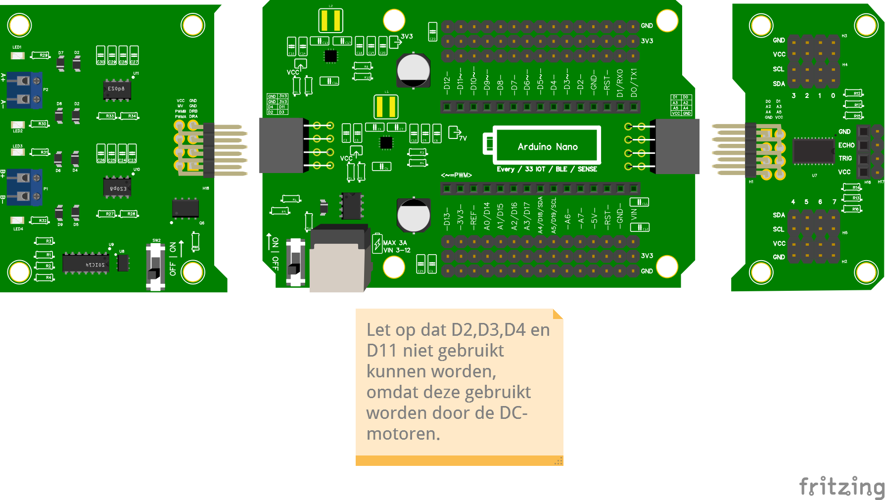

# 2.9 Pinoverzicht Nano RP2040 Connect

Hieronder zie je welke pin je voor wat gebruikt in een complete Redden-Basis-opstelling.

Het bijbehorende Fritzing-bestand: [Fritzing Redden Basis](/docs/redden_basis.fzz).

## Snel-overzicht

- **D2, D3, D4, D11**: bezet door het **motor shield**. Niet gebruiken voor sensoren.
- **A4, A5**: bezet door **I2C** (SDA/SCL, voor multiplexer, TOF, OLED).
- **A0, A1, A2, A3, A6, A7**: vrij voor **IR-sensoren**.
- Overige `D`-pinnen: vrij voor servo, buzzer, afstandssensor, etc.

Controlevraag

Je hebt een TOF, een OLED-scherm en wilt twee IR-sensoren toevoegen. Op welke pinnen sluit je de IR-sensoren aan?

Antwoord

Op twee uit **A0, A1, A2, A3, A6, A7**. Bijvoorbeeld **A0** en **A1**. Niet op A4 of A5, want die zijn nodig voor de TOF en het OLED-scherm.

