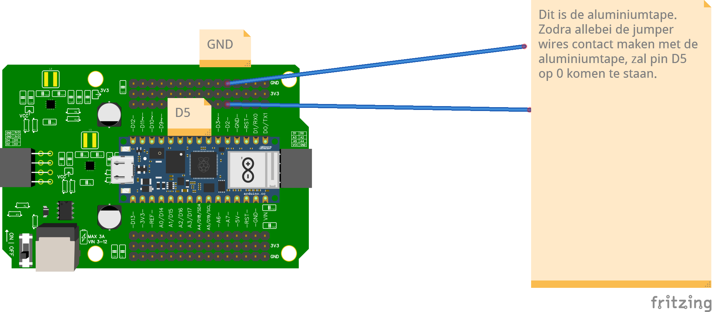

# 2.4 Evacuatiezone detecteren

De evacuatiezone wordt aangegeven met **aluminiumtape** op de baan. Zodra je daaroverheen rijdt, moet je robot dat herkennen.

## Optie 1: detectie via een pull-up resistor

Zet twee draadjes naast elkaar zodat ze elkaar raken zodra ze samen de aluminiumtape raken — dan sluit het tape de twee draden kort.



## Code

```python
from machine import Pin
from time import sleep

pin = Pin("D5", Pin.IN, Pin.PULL_UP)

while True:
    print(pin.value())
    sleep(0.1)
```

Zodra de twee draden via het aluminiumtape verbinden, valt **pin D5** naar **0**.

:::danger Gebruik nooit D2, D3, D10 of D11

Deze pinnen zijn bezet door het **motor shield**. Kies dus een andere vrije pin (bijvoorbeeld **D5** zoals hierboven).

:::

## Optie 2: detectie via een RGB-sensor

Een **RGB-sensor** geeft een andere waarde bij:

- wit
- zwart
- de zilverkleurige aluminiumtape

Vraag jezelf af:

- Welke waardes lees je in elk van de drie gevallen?
- Hoe groot is het verschil?

<details>
<summary>Controlevraag</summary>

Waarom werkt `Pin.PULL_UP` hier en geen "gewone" `Pin.IN`?

</details>

<details>
<summary>Antwoord</summary>

Met `PULL_UP` staat de pin standaard op **1** (HIGH). Zodra de twee draadjes via het aluminiumtape verbinding maken, wordt de pin doorverbonden naar GND en valt hij naar **0**. Zonder pull-up zou de pin "zweven" en willekeurige waardes geven.

</details>
