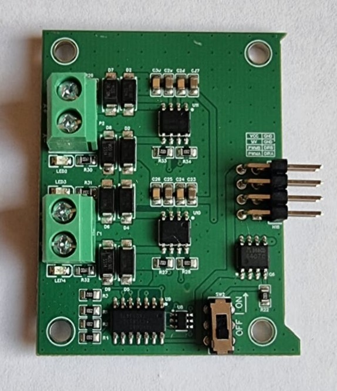
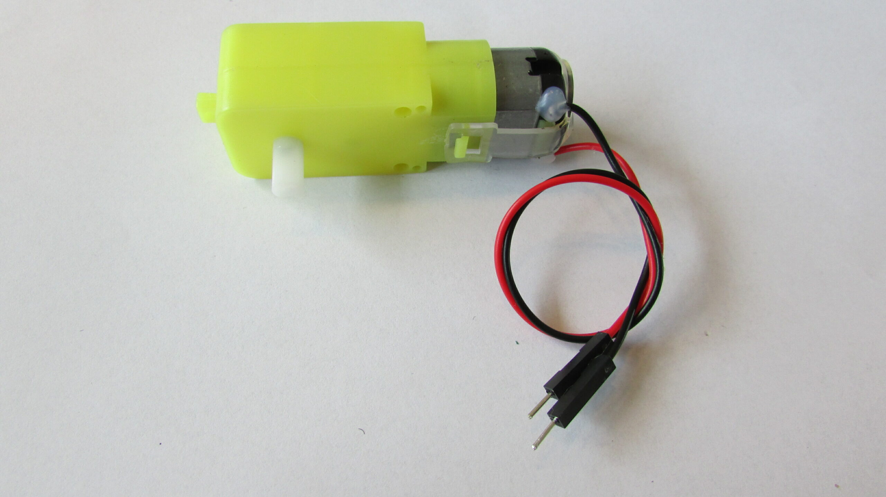

# 13.1 Materiaal

DC-motoren zijn de wielmotoren van je robot. Ze hebben veel stroom nodig, dus we sturen ze niet rechtstreeks vanaf de microcontroller aan, maar via een **motor shield**.

Wat heb je nodig?

1. [Arduino Nano RP2040 Connect](https://docs.arduino.cc/hardware/nano-rp2040-connect/)
2. Leaphy Murphy Shield
3. Motor Module voor het Leaphy Murphy Shield
4. **2x** DC-motor (TT-motor)

## Leaphy Murphy Shield

## Motor Module voor Leaphy Murphy Shield

## TT-motor

Controlevraag

Waarom heb je een motor shield nodig en kun je de motoren niet rechtstreeks op de Nano aansluiten?

Antwoord

DC-motoren trekken veel meer **stroom** dan de pinnen van de microcontroller kunnen leveren. Het shield haalt die stroom uit de batterij en stuurt hem onder controle naar de motoren.

