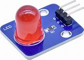

# 6.1 Materiaal

Een **RGB-LED** is een lampje dat in elke kleur kan branden. Hij heeft drie kanalen: rood (R), groen (G) en blauw (B). Door die te mengen krijg je alle kleuren.

Wat heb je nodig?

1. Arduino Nano RP2040 Connect
2. RGB-LED-module

Controlevraag

Hoeveel pinnen heeft deze RGB-LED-module nodig op de microcontroller?

Antwoord

**Vier** in totaal: één GND-pin en drie digitale pinnen (voor R, G en B). De drie kleurpinnen moeten **PWM** ondersteunen, anders kun je geen tussenkleuren maken.

